# 시스템 아키텍처 설계서

> **문서 정보**

| 항목 | 내용 |
|------|------|
| 프로젝트명 | 2026_TV — 차세대 미디어 플랫폼 |
| 문서 버전 | v1.3 |
| 작성일 | 2026-03-04 |
| 작성자 | 개발팀 |
| 상태 | 확정 (Weekly VOD Curation v2 반영) |

---

## 1. 전체 시스템 구성도

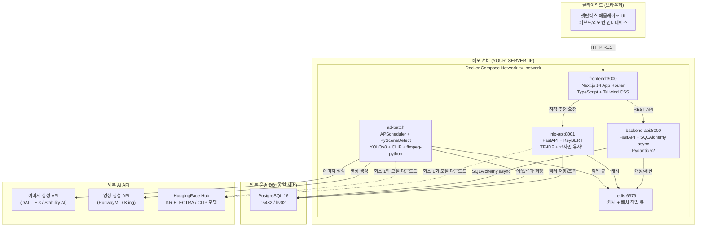

---

## 2. 기술 스택

### 2.1 서비스별 기술 스택

| 서비스 | 언어/런타임 | 주요 프레임워크 & ML 모델 | 포트 |
|--------|------------|------------------------|------|
| **frontend** | TypeScript / Node.js | Next.js 14 (App Router), Tailwind CSS | 3000 |
| **backend-api** | Python 3.11 | FastAPI, SQLAlchemy (async), Pydantic v2, asyncpg | 8000 |
| **nlp-api** | Python 3.11 | FastAPI, scikit-learn TF-IDF, KeyBERT (`snunlp/KR-ELECTRA-discriminator`) | 8001 |
| **ad-batch** | Python 3.11 | APScheduler, PySceneDetect, YOLOv8n (COCO 80클래스), CLIP (`openai/clip-vit-base-patch32`), ffmpeg-python | - (백그라운드) |
| **redis** | - | Redis 7 Alpine | 6379 |
| **DB** | PostgreSQL 16 | - | 5432 (외부) |

### 2.2 공통 인프라

| 항목 | 기술 |
|------|------|
| 컨테이너 오케스트레이션 | Docker + docker-compose v3.9 |
| 로깅 | structlog (전 서비스 통일) |
| 설정 관리 | pydantic-settings + `.env` 파일 |
| DB 연결 | asyncpg (비동기), psycopg2-binary (배치 동기) |

---

## 3. 서비스별 상세 설계

### 3.1 frontend (Next.js)

**역할**: 셋탑박스 UI 에뮬레이터 — 채널 시청, VOD 탐색, 커머스

**화면 구성**:

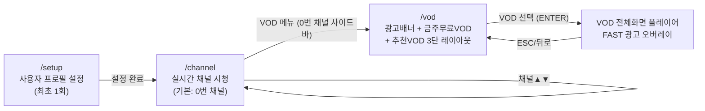

**VOD 페이지 구성** (`/vod`):

| 영역 | 내용 | 동작 |
|------|------|------|
| 광고 배너 | 단일 캐러셀 (3개), 5초 자동 전환 | ENTER → 광고 상세 팝업 모달 |
| 금주의 무료 VOD | 10개 중 6개 슬라이딩 윈도우 | ENTER → 전체화면 VOD 재생 (FAST 광고 적용) |
| 추천 VOD | 10개 중 6개 슬라이딩 윈도우 | ENTER → 전체화면 VOD 재생 |

**핵심 컴포넌트**:

| 컴포넌트 | 역할 | 위치 |
|---------|------|------|
| `ChannelPlayer` | HLS.js 스트리밍 + Zapping 키 이벤트 | `/components/ChannelPlayer` |
| `CommerceChannel` | 0번 채널 커머스 UI (사이드바 + 상품 목록) | `/components/CommerceChannel` |
| `ShoppingRow` | 상품 카드 수평 스크롤 목록 | `/components/CommerceChannel/ShoppingRow` |
| `Sidebar` | 채널 메뉴 네비게이션 | `/components/CommerceChannel/Sidebar` |
| `VideoPlayer` | 추천 채널 영상 플레이어 | `/components/CommerceChannel/VideoPlayer` |
| `PurchaseModal` | 상품 구매 모달 (가격 < 20만원) | `/components/CommerceChannel/PurchaseModal` |
| `ConsultModal` | 상담 연결 모달 (가격 ≥ 20만원) | `/components/CommerceChannel/ConsultModal` |
| `ShoppingOverlay` | 비전 AI 쇼핑 매칭 결과 오버레이 | `/components/ShoppingOverlay` |
| `AdOverlay` | FAST 광고 오버레이 (타임스탬프 기반) | `/components/AdOverlay` |

**키 이벤트 매핑**:

| 키 | 동작 | 적용 화면 |
|----|------|---------|
| `▲` (ArrowUp) | 채널 올리기 / VOD 섹션 이동 | 채널, VOD |
| `▼` (ArrowDown) | 채널 내리기 / VOD 섹션 이동 | 채널, VOD |
| `←/→` | 포커스 이동 / 배너 이동 | 0번 채널, VOD |
| `L` | 채널 편성표 토글 | 1~30번 채널 |
| `ENTER` | 메뉴/상품/VOD 선택 | 전체 |
| `ESC` | 편성표/모달 닫기 / VOD 뒤로 | 전체 |
| `B` | 사이드바 토글 | 0번 커머스 |

---

### 3.2 backend-api (FastAPI)

**역할**: 메인 비즈니스 로직 API — 채널, VOD, 쇼핑, 세션, 광고, 커머스

**API 라우터 구성**:

| 메서드 | 경로 | 기능 | 연결 테이블 |
|--------|------|------|-----------| 
| GET | `/health` | 헬스체크 | - |
| GET | `/api/v1/channels` | 채널 목록 조회 | `TB_CHANNEL_CONFIG` |
| GET | `/api/v1/channels/{no}` | 채널 상세 조회 | `TB_CHANNEL_CONFIG` |
| GET | `/api/v1/commerce/data` | 0번 채널 커머스 데이터 | `TB_PROD_INFO` |
| GET | `/api/v1/vod/weekly` | 금주 무료 VOD (트랙1) | `TB_WEEKLY_FREE_VOD`, `TB_VOD_META` |
| GET | `/api/v1/vod/free` | 무료 VOD 목록 | `TB_VOD_META` |
| GET | `/api/v1/vod/{assetId}` | VOD 상세 정보 | `TB_VOD_META` |
| GET | `/api/v1/ad/insertion-points/{assetId}` | 광고 삽입 타임스탬프 | `TB_FAST_AD_INSERTION_POINT` |
| GET | `/api/v1/shopping/match` | 키워드 기반 상품 매칭 | `TB_PROD_INFO` |
| GET | `/api/v1/shopping/products` | 상품 목록 조회 | `TB_PROD_INFO` |
| POST | `/api/v1/sessions/start` | 시청 세션 시작 | `TB_WATCH_SESSION` |
| PATCH | `/api/v1/sessions/{id}/end` | 시청 세션 종료 | `TB_WATCH_SESSION` |
| GET | `/api/v1/customers/{id}` | 고객 프로필 조회 | `TB_CUST_INFO` |

**의존성**:
- PostgreSQL (SQLAlchemy async via asyncpg)
- Redis (채널 목록, 금주 VOD 캐싱)

---

### 3.3 nlp-api (FastAPI)

**역할**: NLP 기반 VOD 개인화 추천 엔진

**API 엔드포인트**:

| 메서드 | 경로 | 기능 |
|--------|------|------|
| GET | `/health` | 헬스체크 (`tfidf_ready` 상태 포함) |
| POST | `/admin/recommend` | 특정 유저 개인화 VOD 추천 10개 반환 |
| POST | `/admin/update_user_profile` | 유저 프로필 벡터 재계산 후 TB_USER_PROFILE_VECTOR upsert |
| POST | `/admin/vod_proc` | VOD 전체 TF-IDF 벡터 재계산 + 모델 파일 저장 |

**서비스 기동 순서** (lifespan):

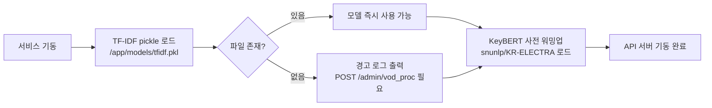

**NLP 추천 파이프라인** (POST /admin/recommend):

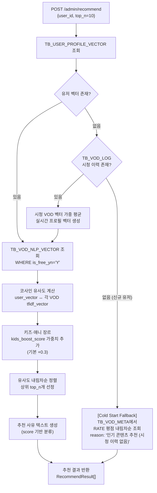

**TF-IDF 벡터화 방법**:

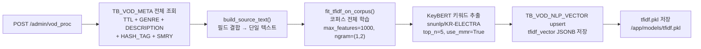

**유저 프로필 벡터 갱신** (POST /admin/update_user_profile):

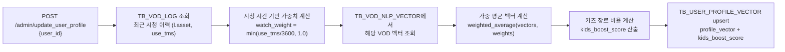

---

### 3.4 ad-batch (Python Batch Worker)

**역할**: FAST 광고 생성 파이프라인 (주 1회 APScheduler 배치)

**전체 배치 실행 흐름**:

```mermaid
flowchart TD
    TRIGGER["트리거: 매주 월요일 02:00 KST<br/>APScheduler (AD_BATCH_CRON)"] --> RESTORE
    RESTORE["_restore_previous_free_vod()<br/>이전 주 VOD IS_FREE_YN='N' 복원<br/>(현재주 선정 VOD 제외)"] --> DEACTIVATE
    DEACTIVATE["이전 TB_WEEKLY_FREE_VOD IS_ACTIVE='N'"] --> SELECT

    SELECT["select_weekly_free_vod() v2<br/>[Hard Filter]<br/>USE_FL=1, SVC_APY_FL=1<br/>THMBNL_FL=1, IS_FREE_YN='N'<br/>DISP_RTM >= '00:20:00' (20분+)"] --> SCORE

    SCORE["[Soft Score] CTE: filtered_data<br/>인기작 IS_HOT_FL +15<br/>고화질 SCREEN_TP +10<br/>키즈 1화 유도 +15<br/>4060 키워드 +20<br/>월별 시즌 테마 +30 (seasonal_themes.py)"] --> DEDUP

    DEDUP["[CTE: deduplicated_data]<br/>SUPER_ASSET_NM 기준 시리즈당 1편<br/>(최고점 우선 → RLSE_YEAR → EPSD_NO ASC)"] --> SLOT

    SLOT["[CTE: ranked_slots]<br/>슬롯 내 순위 부여"] --> EXTRACT

    EXTRACT["[최종 10개 추출] 슬롯 비율 적용<br/>KIDS ≤3개 (SLOT_KIDS)<br/>DOCU_LIFE ≤4개 (SLOT_DOCU)<br/>ENTERTAINMENT ≤2개 (SLOT_ENT)<br/>ETC ≤1개 (SLOT_ETC)"] --> UPDATE_WEEKLY

    UPDATE_WEEKLY["TB_WEEKLY_FREE_VOD upsert<br/>week_start_ymd + asset_id<br/>SELECTION_REASON = SLOT_xxx"] --> SHORTAGE
    SHORTAGE{"선정 수 < 10?"}
    SHORTAGE --> |"예"| WARN["log.warning<br/>weekly_vod.slot_shortage"]
    SHORTAGE --> |"아니오"| PIPELINE
    WARN --> PIPELINE

    PIPELINE["run_fast_ad_pipeline()<br/>각 VOD별 파이프라인 실행"] --> STATUS_START
    STATUS_START["TB_WEEKLY_FREE_VOD<br/>AD_PIPELINE_STATUS = 'IN_PROGRESS'"] --> STEP1

    STEP1["1단계: scene_detector.py<br/>PySceneDetect ContentDetector<br/>threshold=30.0 / 비디오 프레임만<br/>각 씬 시작점 keyframe.png 추출 (ffmpeg)"] --> STEP2

    STEP2["2단계: vision_analyzer.py<br/>각 키프레임 분석"] --> STEP2A & STEP2B & STEP2C

    STEP2A["YOLO v8n (COCO 80클래스)<br/>객체 감지<br/>conf=0.5 이상만"] --> MERGE
    STEP2B["CLIP (openai/clip-vit-base-patch32)<br/>20개 컨텍스트 태그와 유사도<br/>softmax → 상위 5개 선택<br/>CLIP_ENABLED=false 시 스킵"] --> MERGE
    STEP2C["PIL 색상 추출<br/>이미지 100×100 축소<br/>64px 버킷 그룹핑<br/>상위 3색 HEX"] --> MERGE

    MERGE["vision_tags 통합<br/>YOLO + CLIP 중복제거 최대 10개"] --> STEP3

    STEP3["3단계: ad_generator.py<br/>keywords_to_prompt() 변환"] --> STEP3A & STEP3B

    STEP3A["이미지 광고 생성<br/>DALL-E 3 API 호출<br/>→ 1024×1024 PNG<br/>API 키 없음 → PIL 플레이스홀더"] --> SAVE_ASSET
    STEP3B["비디오 광고 생성<br/>RunwayML/Kling API 호출<br/>→ 4초 MP4 무음<br/>API 키 없음 → ffmpeg 검은화면"] --> SAVE_ASSET

    SAVE_ASSET["TB_FAST_AD_ASSET 저장<br/>file_path + SOURCE_KEYWORDS<br/>+ GEN_PROMPT + GEN_API_MODEL"] --> STEP4

    STEP4["4단계: timestamp_calculator.py<br/>씬 목록에서 삽입 포인트 선정<br/>최대 5개"] --> STEP4_LOGIC

    STEP4_LOGIC["선정 기준:<br/>motion_score = 1 - (씬길이/최대씬길이)<br/>confidence = 1 - motion_score<br/>timestamp = 씬시작 + 1.0초<br/>reason: LOW_MOTION/SCENE_BREAK/QUIET_MOMENT"] --> SAVE_POINT

    SAVE_POINT["TB_FAST_AD_INSERTION_POINT 저장<br/>timestamp_sec + confidence<br/>display_duration_sec=4.0<br/>display_position=OVERLAY_BOTTOM"] --> STATUS_DONE

    STATUS_DONE["TB_WEEKLY_FREE_VOD<br/>AD_PIPELINE_STATUS = 'COMPLETED'"]
```


**중요 설계 원칙**:
- 원본 VOD 파일 **수정 없음** — 클라이언트 AdOverlay로 비침습적 광고 노출
- 씬 분할 시 **오디오 분석 철저 배제** — 비디오 ContentDetector만 사용
- VOD 파일 없을 경우 더미 씬으로 계속 진행 (API 키 있으면 생성형 에셋 생성 가능)
- 생성된 광고 에셋: 컨테이너 볼륨 `/app/data/ad_assets`에 저장

---

## 4. 데이터 흐름 설계

### 4.1 채널 Zapping 흐름

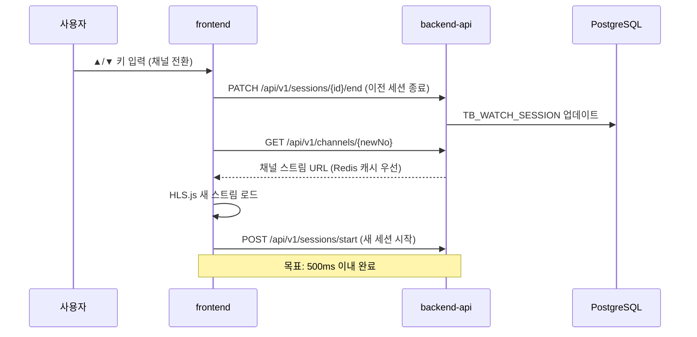

### 4.2 커머스 채널 상품 조회 흐름

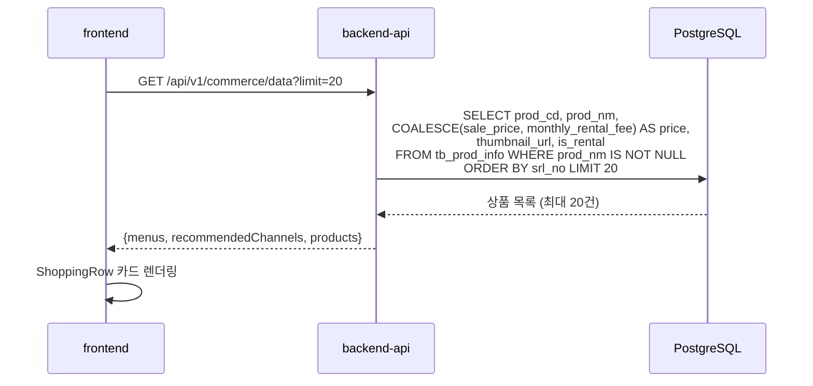

### 4.3 VOD 재생 + FAST 광고 오버레이 흐름

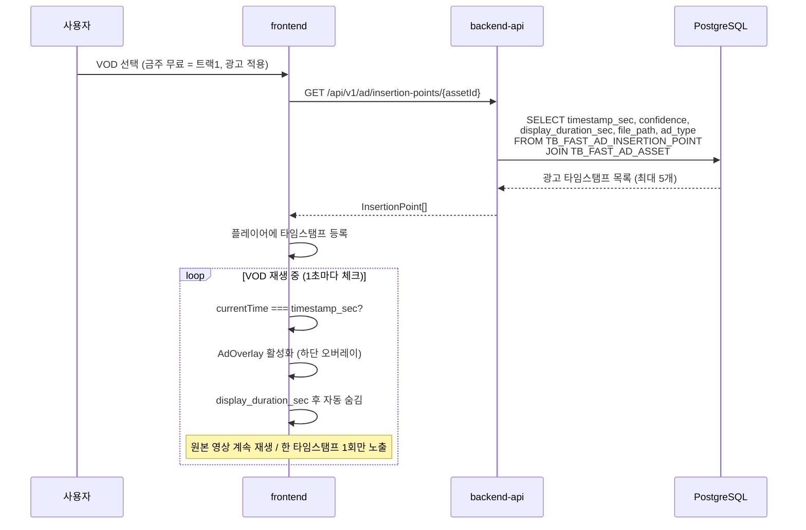

### 4.4 NLP 개인화 추천 흐름

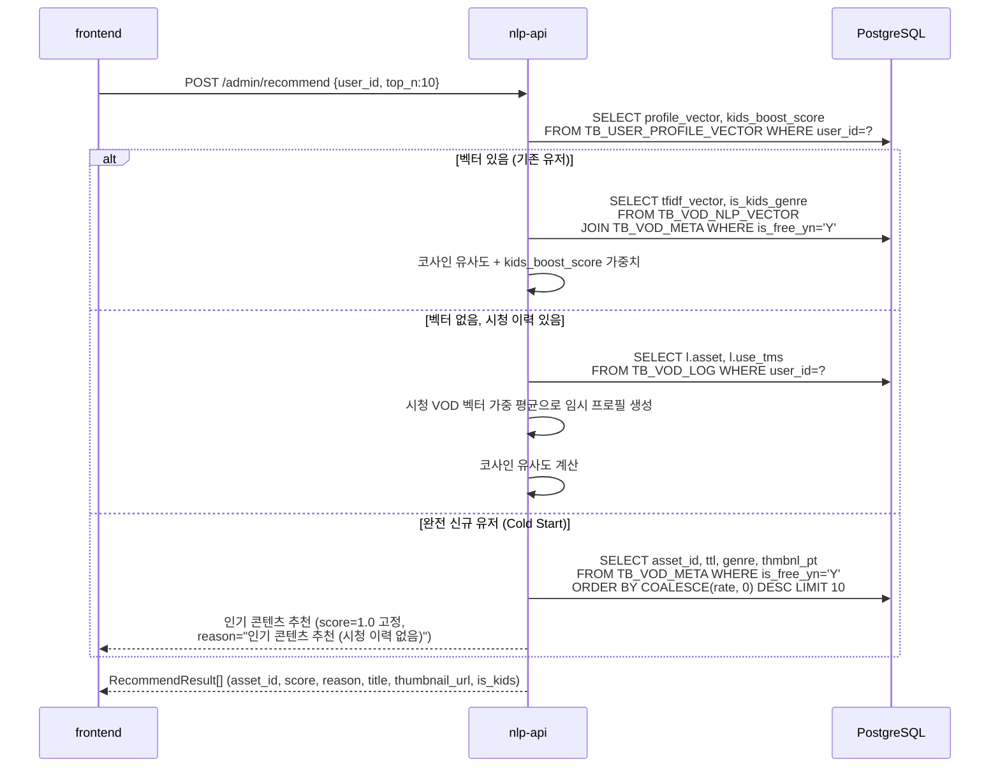

---

## 5. 배포 아키텍처

### 5.1 Docker Compose 구성

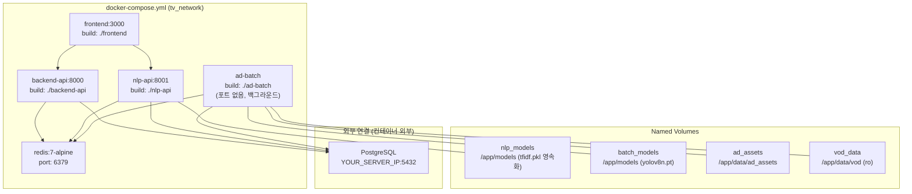

### 5.2 환경변수 관리

| 변수명 | 사용 서비스 | 설명 |
|--------|-----------|------|
| `DATABASE_URL` | backend-api, nlp-api, ad-batch | PostgreSQL asyncpg 연결 URL |
| `DATABASE_SYNC_URL` | ad-batch | psycopg2 동기 연결 URL |
| `REDIS_URL` | backend-api, nlp-api, ad-batch | Redis 연결 URL |
| `NEXT_PUBLIC_API_URL` | frontend (빌드시) | backend-api 주소 |
| `NEXT_PUBLIC_NLP_API_URL` | frontend (빌드시) | nlp-api 주소 |
| `CORS_ORIGINS` | backend-api | 허용 CORS 오리진 |
| `KEYBERT_MODEL` | nlp-api | HuggingFace 모델명 (기본: `snunlp/KR-ELECTRA-discriminator`) |
| `TFIDF_MODEL_PATH` | nlp-api | TF-IDF pickle 저장 경로 (기본: `/app/models/tfidf.pkl`) |
| `KIDS_BOOST_SCORE` | nlp-api | 키즈·애니 추천 가중치 (0.0~1.0, 기본 0.3) |
| `KIDS_GENRE_CODES` | nlp-api | 키즈 장르 코드 목록 (기본: `KIDS,ANIME,ANIMATION`) |
| `YOLO_MODEL_PATH` | ad-batch | YOLOv8 가중치 경로 (기본: `yolov8n.pt`, 자동 다운로드) |
| `CLIP_ENABLED` | ad-batch | CLIP 모델 활성화 여부 (기본: `true`, CPU 환경: `false` 권장) |
| `CLIP_MODEL` | ad-batch | CLIP HuggingFace 모델명 (기본: `openai/clip-vit-base-patch32`) |
| `VISION_CONFIDENCE_THRESHOLD` | ad-batch | YOLO 최소 신뢰도 (기본: `0.5`) |
| `IMAGE_GEN_API_KEY` | ad-batch | 이미지 생성 AI API 키 (없으면 PIL 플레이스홀더) |
| `IMAGE_GEN_API_URL` | ad-batch | 이미지 생성 AI 엔드포인트 |
| `VIDEO_GEN_API_KEY` | ad-batch | 영상 생성 AI API 키 (없으면 ffmpeg 검은화면) |
| `VIDEO_GEN_API_URL` | ad-batch | 영상 생성 AI 엔드포인트 |
| `AD_BATCH_CRON` | ad-batch | 배치 스케줄 (기본: `0 2 * * 1` 매주 월 02:00) |
| `WEEKLY_FREE_VOD_COUNT` | ad-batch | 주간 무료 VOD 선정 수 (기본: 10) |
| `AD_ASSET_DIR` | ad-batch | 광고 에셋 저장 디렉토리 |
| `VOD_SOURCE_DIR` | ad-batch | 원본 VOD 파일 디렉토리 |

---

## 6. 모델 파일 관리

### 6.1 모델 종류별 관리 방식

| 모델 | 크기 | 획득 방법 | 저장 위치 | 재시작 시 |
|------|------|----------|----------|---------|
| **YOLOv8n** | ~6MB | ultralytics 자동 다운로드 | `~/.cache/ultralytics/` 또는 `YOLO_MODEL_PATH` | 재사용 |
| **KeyBERT (KR-ELECTRA)** | ~430MB | HuggingFace 자동 다운로드 | `~/.cache/huggingface/` | 재사용 |
| **CLIP (clip-vit-base-patch32)** | ~600MB | HuggingFace 자동 다운로드 | `~/.cache/huggingface/` | 재사용 |
| **TF-IDF Vectorizer** | ~수KB | `/admin/vod_proc` 호출 시 학습 | `/app/models/tfidf.pkl` **(영속화)** | 자동 로드 |

### 6.2 초기 운영 절차

```
1. 서비스 최초 배포
   → HuggingFace 모델 자동 다운로드 (~1GB, 인터넷 필요)
   → YOLOv8n 자동 다운로드 (~6MB)

2. TF-IDF 초기 학습 (최초 1회 필수)
   POST http://nlp-api:8001/admin/vod_proc
   → TB_VOD_META 전체 학습 → tfidf.pkl 저장

3. 유저 프로필 초기화 (VOD 시청 후)
   POST http://nlp-api:8001/admin/update_user_profile?user_id={id}
   → 개인화 추천 활성화
```

---

## 7. 디렉토리 구조

```
2026_TV/
├── docker-compose.yml              # 서비스 오케스트레이션
├── .env                            # 실제 환경변수 (Git 제외)
├── .env.example                    # 환경변수 템플릿
│
├── docs/
│   ├── 1_requirements_specification.md
│   ├── 2_system_architecture.md          # 이 문서
│   ├── ddl.sql                           # 기존 테이블 DDL
│   └── schema_additions.sql              # 신규 테이블 DDL
│
├── frontend/
│   ├── app/
│   │   ├── channel/page.tsx        # 채널 시청 (기본: 0번)
│   │   ├── vod/page.tsx            # VOD 3단 레이아웃
│   │   └── setup/page.tsx          # 사용자 초기 설정
│   ├── components/
│   │   ├── AdOverlay/              # FAST 광고 오버레이
│   │   ├── CommerceChannel/        # 0번 채널 커머스 전체
│   │   └── ShoppingOverlay/        # 비전 AI 쇼핑 오버레이
│   ├── hooks/useRemoteFocus.ts     # 리모컨 키 포커스 관리
│   └── lib/api.ts                  # API 클라이언트 + 타입
│
├── backend-api/app/
│   ├── main.py
│   ├── core/ (config, db)
│   └── api/v1/ (channels, vod, ad, shopping, sessions, commerce, customers)
│
├── nlp-api/app/
│   ├── main.py                     # lifespan: TF-IDF 로드 + KeyBERT 워밍업
│   ├── api/vod_proc.py             # 추천/벡터화/프로필 갱신 엔드포인트
│   ├── vectorizer.py               # TF-IDF + KeyBERT + save/load
│   └── recommender.py              # 코사인 유사도 + 키즈 가중치
│
└── ad-batch/app/
    ├── main.py                     # APScheduler 진입점 + v2 슬롯 기반 선정 + 4단계 파이프라인
    ├── seasonal_themes.py          # [NEW v2] 12개월 시즌 테마 딕셔너리 + SQL CASE-WHEN 생성
    ├── scene_detector.py           # PySceneDetect + ffmpeg 키프레임 추출
    ├── vision_analyzer.py          # YOLOv8 + CLIP + PIL 색상 추출
    ├── ad_generator.py             # DALL-E 3 / 영상 생성 API + 플레이스홀더
    └── timestamp_calculator.py     # 저움직임 구간 → 삽입 타임스탬프
```

---

## 8. 성능 설계

| 항목 | 목표 | 구현 방법 |
|------|------|------------|
| 채널 전환 | < 500ms | HLS 프리로드, Redis 채널 URL 캐시 |
| 커머스 상품 조회 | < 300ms | srl_no 기준 정렬, DB 인덱스 활용 |
| VOD 개인화 추천 | < 200ms | 유저 벡터 사전 계산 (TB_USER_PROFILE_VECTOR) |
| Cold Start 추천 | < 100ms | 단순 ORDER BY rate DESC (벡터 연산 없음) |
| 광고 오버레이 렌더링 | < 100ms | 에셋 사전 생성 + 로컬 볼륨 마운트 |
| TF-IDF 모델 로드 | 즉시 (재시작 시) | pickle 영속화 자동 로드 |
| KeyBERT 워밍업 | 서비스 기동 시 1회 | lifespan에서 사전 로드 |
| CLIP 분석 | 씬당 ~1초 (CPU) | GPU 환경 권장, CPU 시 CLIP_ENABLED=false 가능 |
| DB 연결 풀 | pool_size=10, overflow=20 | SQLAlchemy async engine |

---

## 9. 보안 설계

| 항목 | 설계 |
|------|------|
| 접속 정보 격리 | 모든 민감정보 `.env`에서만 관리, 코드 하드코딩 금지 |
| Git 보안 | `.env`는 `.gitignore` 필수 포함 |
| CORS | 운영환경에서 `CORS_ORIGINS=*` 사용 금지, 도메인 명시 |
| DB 패스워드 | `config.py` 기본값 없음, `.env`에서 반드시 주입 |
| 서비스 간 통신 | Docker 내부 네트워크(`tv_network`) 사용, 불필요한 포트 노출 최소화 |
| AI API 키 | `IMAGE_GEN_API_KEY`, `VIDEO_GEN_API_KEY`는 ad-batch 서비스에서만 사용 |
| 고객 ID | `SHA2_HASH` 사용으로 원본 개인정보 비노출 |
