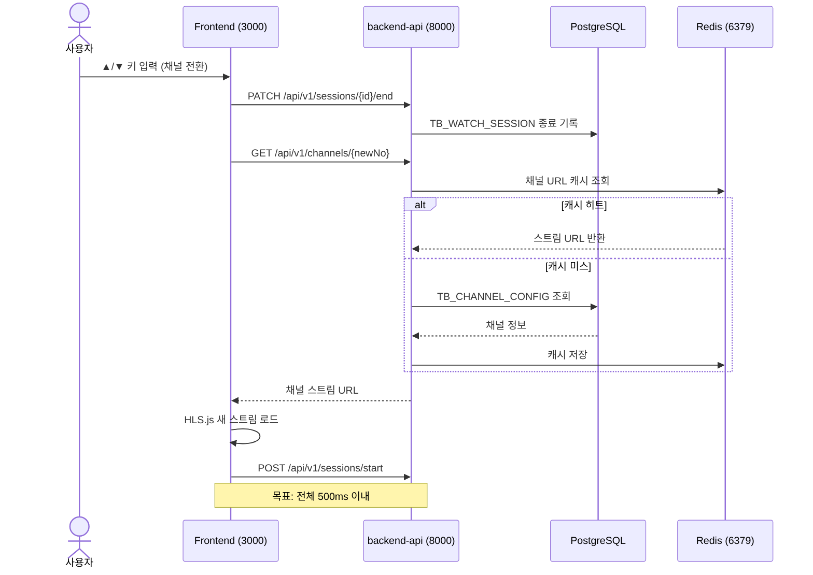
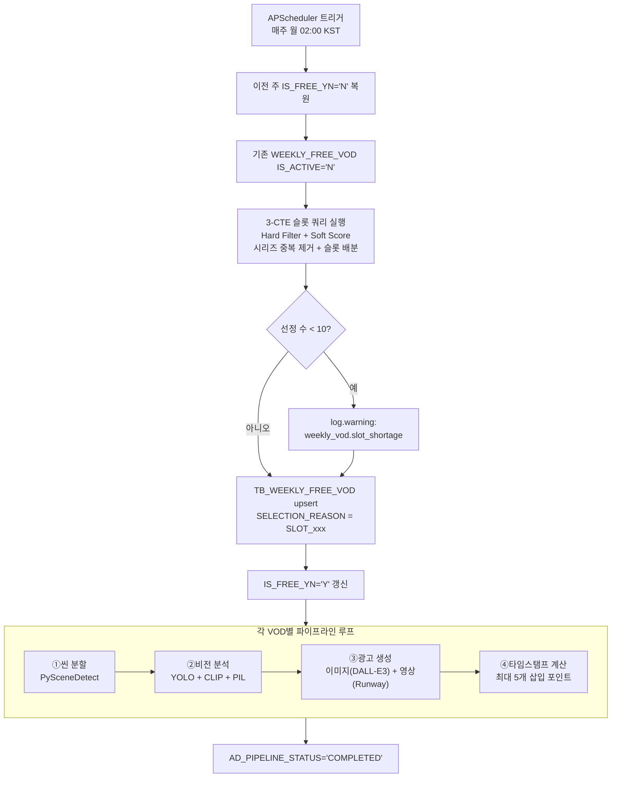
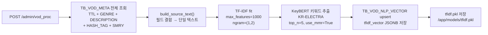

# A-02. 프로세스 정의서 (To-Be Process)

> **문서 정보**

| 항목 | 내용 |
|------|------|
| 프로젝트명 | 2026_TV — 차세대 미디어 플랫폼 |
| 문서 번호 | A-02 |
| 문서 버전 | v1.0 |
| 작성일 | 2026-03-04 |
| 작성자 | 개발팀 |

---

## 1. 전체 프로세스 맵

```mermaid
graph LR
    A[사용자 진입] --> B{tv_user_id?}
    B --> |없음| C[/setup 프로필 설정]
    B --> |있음| D[/channel 진입]
    C --> D
    D --> E{채널 번호}
    E --> |0번| F[커머스 채널]
    E --> |1~30번| G[실시간 방송]
    F --> H[VOD 메뉴 선택]
    H --> I[/vod VOD 페이지]
    G --> I
    I --> J{섹션 선택}
    J --> |금주 무료 VOD| K[트랙1 VOD 재생<br/>FAST 광고 포함]
    J --> |추천 VOD| L[트랙2 VOD 재생<br/>광고 없음]
```

---

## 2. 프로세스 상세 정의

### 2.1 사용자 온보딩 프로세스 (P-001)

```mermaid
flowchart TD
    START([사용자 브라우저 접속]) --> CHECK{localStorage<br/>tv_user_id 존재?}
    CHECK --> |없음| SETUP[/setup 페이지 표시]
    CHECK --> |있음| CHANNEL[/channel 진입]
    SETUP --> INPUT[사용자 ID 입력]
    INPUT --> SAVE[localStorage 저장]
    SAVE --> CHANNEL
    CHANNEL --> COMMERCE[0번 채널 커머스 표시]

    style START fill:#4CAF50,color:#fff
    style COMMERCE fill:#2196F3,color:#fff
```

**프로세스 설명**:
- 최초 방문자는 반드시 `/setup`을 거쳐야 함
- `tv_user_id`는 클라이언트 localStorage에만 저장 (서버 인증 없음)
- 설정 완료 후 자동으로 0번 채널(커머스)로 이동

---

### 2.2 채널 Zapping 프로세스 (P-002)



**KPI**: 채널 전환 응답시간 ≤ 500ms

---

### 2.3 0번 채널 커머스 상품 탐색 프로세스 (P-003)

```mermaid
flowchart TD
    ENTER[0번 채널 진입] --> LOAD[TB_PROD_INFO 조회<br/>srl_no 순 최대 20개]
    LOAD --> DISPLAY[상품 카드 목록 표시]
    DISPLAY --> NAV{키 입력}
    NAV --> |←→| MOVE[포커스 이동]
    NAV --> |B키| SIDEBAR[사이드바 토글]
    NAV --> |ENTER| PRICE{가격 확인}
    MOVE --> NAV
    SIDEBAR --> NAV
    PRICE --> |< 200,000원| PURCHASE[구매 모달 표시]
    PRICE --> |≥ 200,000원| CONSULT[상담 모달 표시]
    SIDEBAR --> |VOD 메뉴| VOD_PAGE[/vod 이동]

    style ENTER fill:#FF9800,color:#fff
    style PURCHASE fill:#4CAF50,color:#fff
    style CONSULT fill:#2196F3,color:#fff
```

---

### 2.4 VOD 탐색 및 재생 프로세스 (P-004)

```mermaid
flowchart TD
    VOD_PAGE["/vod 페이지 진입"] --> LOAD_ALL["3개 섹션 동시 로드<br/>① 광고 배너<br/>② 금주 무료 VOD (트랙1)<br/>③ 추천 VOD (트랙2)"]
    LOAD_ALL --> FOCUS[최초 포커스: 금주 무료 VOD 1번]

    FOCUS --> KEY{키 입력}
    KEY --> |▲▼| SECTION[섹션 이동]
    KEY --> |←→| ITEM[항목 이동<br/>슬라이딩 윈도우]
    KEY --> |ENTER 트랙1| AD_VOD[트랙1 재생 요청]
    KEY --> |ENTER 트랙2| FREE_VOD[트랙2 재생]
    KEY --> |ESC| BACK[이전 화면]

    AD_VOD --> GET_AD[GET /api/v1/ad/insertion-points/{id}]
    GET_AD --> PLAYER[전체화면 플레이어]
    PLAYER --> AD_CHECK{재생 시간 체크<br/>1초마다}
    AD_CHECK --> |타임스탬프 일치| OVERLAY[AdOverlay 표시 4초]
    OVERLAY --> CONTINUE[영상 계속 재생]
    CONTINUE --> AD_CHECK

    FREE_VOD --> PLAYER2[전체화면 플레이어<br/>광고 없음]

    SECTION --> KEY
    ITEM --> KEY
```

---

### 2.5 NLP 개인화 추천 프로세스 (P-005)

```mermaid
flowchart TD
    REQ["POST /admin/recommend<br/>{user_id, top_n=10}"] --> PROFILE[TB_USER_PROFILE_VECTOR 조회]
    PROFILE --> EXIST{유저 벡터<br/>존재?}

    EXIST --> |있음| VOD_VECS[TB_VOD_NLP_VECTOR 조회<br/>is_free_yn='Y']

    EXIST --> |없음| LOG_CHECK{TB_VOD_LOG<br/>시청 이력 존재?}
    LOG_CHECK --> |있음| TEMP_PROFILE[시청 VOD 벡터<br/>가중 평균으로 임시 프로필 생성]
    LOG_CHECK --> |없음 (신규)| COLD_START["[Cold Start Fallback]<br/>RATE 평점 내림차순 top 10<br/>score=1.0 고정<br/>reason=인기 콘텐츠 추천"]
    TEMP_PROFILE --> VOD_VECS

    VOD_VECS --> COSINE["코사인 유사도 계산<br/>user_vector ↔ tfidf_vector"]
    COSINE --> BOOST["키즈·애니 장르<br/>kids_boost_score +0.3 가중치"]
    BOOST --> SORT[유사도 내림차순 정렬<br/>상위 top_n 선정]
    SORT --> REASON[추천 사유 텍스트 생성]
    REASON --> RESULT[RecommendResult[] 반환]
    COLD_START --> RESULT
```

---

### 2.6 FAST 광고 배치 프로세스 (P-006)



---

### 2.7 TF-IDF 모델 갱신 프로세스 (P-007)


