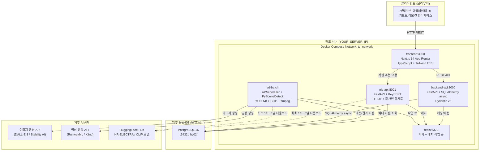

# D-01. 시스템 아키텍처 설계서 (System Architecture Document)

> **문서 정보**

| 항목 | 내용 |
|------|------|
| 프로젝트명 | 2026_TV — 차세대 미디어 플랫폼 |
| 문서 번호 | D-01 |
| 문서 버전 | v1.0 |
| 작성일 | 2026-03-04 |
| 작성자 | 개발팀 |

---

## 1. 전체 시스템 구성도



---

## 2. 기술 스택

### 2.1 서비스별 기술 스택

| 서비스 | 언어/런타임 | 주요 프레임워크 & 모델 | 포트 |
|--------|------------|----------------------|------|
| **frontend** | TypeScript / Node.js 18 | Next.js 14 (App Router), Tailwind CSS, hls.js | 3000 |
| **backend-api** | Python 3.11 | FastAPI, SQLAlchemy (async), Pydantic v2, asyncpg | 8000 |
| **nlp-api** | Python 3.11 | FastAPI, scikit-learn TF-IDF, KeyBERT (`snunlp/KR-ELECTRA-discriminator`) | 8001 |
| **ad-batch** | Python 3.11 | APScheduler, PySceneDetect, YOLOv8n, CLIP (`openai/clip-vit-base-patch32`), ffmpeg-python | - |
| **redis** | - | Redis 7 Alpine | 6379 |
| **DB** | PostgreSQL 16 | - | 5432 (외부) |

### 2.2 공통 인프라

| 항목 | 기술 |
|------|------|
| 컨테이너 오케스트레이션 | Docker + docker-compose v3.9 |
| 로깅 | structlog (전 서비스 통일, JSON 구조화) |
| 설정 관리 | pydantic-settings + `.env` 파일 |
| DB 연결 | asyncpg (비동기 API), psycopg2-binary (배치 동기) |
| 모델 영속화 | Docker Named Volume (`nlp_models`, `batch_models`, `ad_assets`) |

---

## 3. 서비스별 상세 설계

### 3.1 frontend (Next.js 14)

**역할**: 셋탑박스 UI 에뮬레이터 — 채널 시청, VOD 탐색, 커머스

**라우팅 구조**:
```
/setup    → 사용자 프로필 설정 (최초 1회)
/channel  → 실시간 채널 시청 (기본: 0번 채널)
/vod      → 광고배너 + 금주무료VOD + 추천VOD 3단 레이아웃
```

**핵심 컴포넌트**:

| 컴포넌트 | 역할 |
|---------|------|
| `ChannelPlayer` | HLS.js 스트리밍 + Zapping 키 이벤트 |
| `CommerceChannel` | 0번 채널 커머스 UI 전체 |
| `ShoppingRow` | 상품 카드 수평 스크롤 목록 |
| `AdOverlay` | FAST 광고 오버레이 (타임스탬프 기반) |
| `ShoppingOverlay` | 비전 AI 쇼핑 매칭 결과 오버레이 |

**키 이벤트 매핑**:

| 키 | 동작 | 적용 화면 |
|----|------|---------|
| `▲/▼` | 채널 올리기/내리기 / VOD 섹션 이동 | 채널, VOD |
| `←/→` | 포커스 이동 / 배너 이동 | 0번 채널, VOD |
| `L` | 채널 편성표 토글 | 1~30번 채널 |
| `ENTER` | 메뉴/상품/VOD 선택 | 전체 |
| `ESC` | 편성표/모달 닫기 / VOD 뒤로 | 전체 |
| `B` | 사이드바 토글 | 0번 커머스 |

---

### 3.2 backend-api (FastAPI)

**역할**: 메인 비즈니스 로직 API

**API 라우터 구성**:

| 메서드 | 경로 | 기능 |
|--------|------|------|
| GET | `/health` | 헬스체크 |
| GET | `/api/v1/channels` | 활성 채널 목록 조회 |
| GET | `/api/v1/channels/{no}` | 채널 상세 조회 |
| PUT | `/api/v1/channels/{no}/stream` | 채널 스트림 URL 업데이트 |
| GET | `/api/v1/vod/weekly` | 금주 무료 VOD (트랙1) |
| GET | `/api/v1/vod/free` | 무료 VOD 목록 |
| GET | `/api/v1/vod/{assetId}` | VOD 상세 정보 |
| GET | `/api/v1/ad/insertion-points/{assetId}` | 광고 삽입 타임스탬프 |
| GET | `/api/v1/commerce/data` | 0번 채널 커머스 데이터 |
| GET | `/api/v1/shopping/match` | 키워드 기반 상품 매칭 |
| GET | `/api/v1/shopping/products` | 상품 목록 조회 |
| POST | `/api/v1/sessions/start` | 시청 세션 시작 |
| PATCH | `/api/v1/sessions/{id}/end` | 시청 세션 종료 |
| GET | `/api/v1/customers/{id}` | 고객 프로필 조회 |

---

### 3.3 nlp-api (FastAPI)

**역할**: NLP 기반 VOD 개인화 추천 엔진

**서비스 기동 순서 (lifespan)**:
```
1. TF-IDF pickle 로드 (/app/models/tfidf.pkl)
   → 파일 없으면 경고 로그 + POST /admin/vod_proc 필요
2. KeyBERT 사전 워밍업 (snunlp/KR-ELECTRA 로드)
3. API 서버 기동 완료
```

**API 엔드포인트**:

| 메서드 | 경로 | 기능 |
|--------|------|------|
| GET | `/health` | 헬스체크 (`tfidf_ready` 상태 포함) |
| POST | `/admin/recommend` | 개인화 VOD 추천 10개 반환 |
| POST | `/admin/update_user_profile` | 유저 프로필 벡터 재계산 |
| POST | `/admin/vod_proc` | VOD 전체 TF-IDF 벡터 재계산 |

---

### 3.4 ad-batch (APScheduler Worker)

**역할**: FAST 광고 생성 파이프라인 (주 1회 배치)

**파이프라인 4단계**:

| 단계 | 모듈 | 처리 내용 |
|------|------|---------|
| 0 | `main.py` | 이전 주 IS_FREE_YN 복원 → v2 CTE 쿼리로 10개 슬롯 선정 |
| 1 | `scene_detector.py` | PySceneDetect (threshold=30.0) + ffmpeg 키프레임 추출 |
| 2 | `vision_analyzer.py` | YOLOv8n + CLIP + PIL 색상 → vision_tags |
| 3 | `ad_generator.py` | DALL-E 3 이미지 + RunwayML 영상 생성 |
| 4 | `timestamp_calculator.py` | motion_score 기반 삽입 포인트 최대 5개 선정 |

**신규 모듈 (v2)**:
- `seasonal_themes.py`: 12개월 시즌 테마 딕셔너리 + SQL CASE-WHEN 동적 생성

---

## 4. 배포 아키텍처

### 4.1 Docker Compose Named Volumes

| 볼륨명 | 마운트 경로 | 용도 |
|--------|-----------|------|
| `nlp_models` | `/app/models` (nlp-api) | tfidf.pkl 영속화 |
| `batch_models` | `/app/models` (ad-batch) | yolov8n.pt 캐시 |
| `ad_assets` | `/app/data/ad_assets` (ad-batch) | 생성 광고 에셋 저장 |
| `vod_data` | `/app/data/vod` (ad-batch, 읽기 전용) | 원본 VOD 파일 |

### 4.2 네트워크 보안

- 모든 서비스는 Docker 내부 네트워크 `tv_network`에서 통신
- 외부 노출 포트: `3000`(FE), `8000`(BE), `8001`(NLP), `6379`(Redis 선택)
- PostgreSQL: Docker 외부 운영 서버, 컨테이너에 미포함

---

## 5. 성능 설계

| 항목 | 목표 | 구현 방법 |
|------|------|---------|
| 채널 전환 | < 500ms | HLS 프리로드, Redis 채널 URL 캐시 |
| VOD 개인화 추천 | < 200ms | 유저 벡터 사전 계산 |
| Cold Start 추천 | < 100ms | 단순 ORDER BY rate DESC |
| TF-IDF 모델 로드 | 즉시 (재시작 시) | pickle 영속화 자동 로드 |
| DB 연결 풀 | pool_size=10, overflow=20 | SQLAlchemy async engine |

---

## 6. 보안 설계

| 항목 | 설계 |
|------|------|
| 접속 정보 격리 | 모든 민감정보 `.env`에서만 관리 |
| Git 보안 | `.env`는 `.gitignore` 필수 포함 |
| CORS | 운영환경 `CORS_ORIGINS=*` 사용 금지 |
| 고객 ID | `SHA2_HASH` 사용으로 원본 개인정보 비노출 |
| AI API 키 | ad-batch 서비스에서만 사용 |
