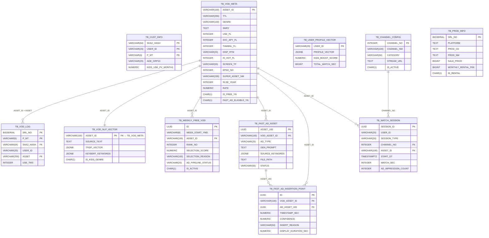

# D-02. 데이터베이스 설계서 (ERD & Table Specification)

> **문서 정보**

| 항목 | 내용 |
|------|------|
| 프로젝트명 | 2026_TV — 차세대 미디어 플랫폼 |
| 문서 번호 | D-02 |
| 문서 버전 | v1.0 |
| 작성일 | 2026-03-04 |
| DB | PostgreSQL 16 @ YOUR_SERVER_IP:5432/hv02 |

---

## 1. ERD (Entity Relationship Diagram)

---

## 2. 테이블 상세 명세

### 2.1 TB_CUST_INFO — 고객 서비스 이용 현황

| 컬럼명 | 타입 | NULL | 기본값 | 설명 |
|--------|------|------|--------|------|
| `SHA2_HASH` | VARCHAR(64) | NOT NULL | - | 고객ID 암호화 (PK1) |
| `USER_ID` | VARCHAR(20) | NOT NULL | - | 고객ID (PK2) |
| `P_MT` | VARCHAR(6) | NOT NULL | - | 데이터 생성 월 YYYYMM (PK3) |
| `AGE_GRP10` | VARCHAR(20) | NULL | - | 고객 연령대 그룹 (10대/20대/40대 등) |
| `KIDS_USE_PV_MONTH1` | NUMERIC | NULL | - | 키즈 메뉴/콘텐츠 조회수 |
| `CH_HH_AVG_MONTH1` | NUMERIC | NULL | - | 월 평균 시청 시간 |
| `CH_FAV_RNK1` | VARCHAR(100) | NULL | - | 가장 많이 시청한 채널명 |
| `NFX_USE_YN` | CHAR(1) | NULL | - | 넷플릭스 앱 이용 여부 |

---

### 2.2 TB_VOD_META — VOD 콘텐츠 마스터

| 컬럼명 | 타입 | NULL | 기본값 | 설명 | 역할 |
|--------|------|------|--------|------|------|
| `ASSET_ID` | VARCHAR(100) | NOT NULL | - | 에셋 ID (PK) | - |
| `TTL` | VARCHAR(255) | NULL | - | 제목 | 시즌 테마 검색 |
| `GENRE` | VARCHAR(100) | NULL | - | 장르(대) | 슬롯 분류 |
| `SMRY` | TEXT | NULL | - | 줄거리 | 4060 키워드 검색 |
| `USE_FL` | INTEGER | NULL | - | 사용여부 (0/1) | 하드 필터 |
| `SVC_APY_FL` | INTEGER | NULL | - | 서비스 적용 플래그 | 하드 필터 |
| `THMBNL_FL` | INTEGER | NULL | - | 썸네일 여부 (0/1) | 하드 필터 |
| `DISP_RTM` | VARCHAR(20) | NULL | - | 상영시간 `HH:MM:SS` | 하드 필터 (≥20분) |
| `IS_HOT_FL` | INTEGER | NULL | - | 인기작 여부 (0/1) | 소프트 점수 +15 |
| `SCREEN_TP` | VARCHAR(50) | NULL | - | 화질 타입 (HD/FHD/UHD) | 소프트 점수 +10 |
| `EPSD_NO` | INTEGER | NULL | - | 회차 번호 | 키즈 1화 유도 가점 |
| `SUPER_ASSET_NM` | VARCHAR(255) | NULL | - | 상위 에셋명 (시리즈명) | 중복 제거 기준 |
| `RLSE_YEAR` | INTEGER | NULL | - | 출시 연도 | 중복 제거 우선순위 |
| `RATE` | NUMERIC | NULL | - | 평점 | Cold Start 정렬 |
| `IS_FREE_YN` | CHAR(1) | NOT NULL | `'N'` | 무료 여부 | 트랙1 선정 후 'Y' 변경 |
| `FAST_AD_ELIGIBLE_YN` | CHAR(1) | NOT NULL | `'N'` | FAST광고 대상 | 트랙1 선정 후 'Y' 변경 |
| `NLP_VECTOR_UPDATED_AT` | TIMESTAMPTZ | NULL | - | NLP 벡터 갱신 일시 | - |

---

### 2.3 TB_VOD_LOG — 고객별 VOD 시청 이력

| 컬럼명 | 타입 | NULL | 설명 |
|--------|------|------|------|
| `SRL_NO` | BIGSERIAL | NOT NULL | 일련번호 (PK1) |
| `P_MT` | VARCHAR(6) | NOT NULL | 데이터 생성 월 (PK2) |
| `SHA2_HASH` | VARCHAR(64) | NULL | 고객ID 암호화 |
| `USER_ID` | VARCHAR(20) | NULL | 고객ID |
| `ASSET` | VARCHAR(255) | NULL | VOD 에셋 ID (→ TB_VOD_META) |
| `ASSET_NM` | VARCHAR(255) | NULL | 콘텐츠명 |
| `USE_TMS` | INTEGER | NULL | 실제 시청시간(초) — 가중치 계산용 |
| `STRT_DT` | VARCHAR(14) | NULL | 시청 시작일시 YYYYMMDDHHMISS |

---

### 2.4 TB_USER_PROFILE_VECTOR — 유저 NLP 프로필 벡터

| 컬럼명 | 타입 | NULL | 기본값 | 설명 |
|--------|------|------|--------|------|
| `USER_ID` | VARCHAR(20) | NOT NULL | - | 고객ID (PK) |
| `PROFILE_VECTOR` | JSONB | NOT NULL | `'[]'` | TF-IDF 공간 유저 선호 벡터 |
| `FAVORITE_GENRES` | JSONB | NOT NULL | `'[]'` | 선호 장르 코드 목록 |
| `FAVORITE_KEYWORDS` | JSONB | NOT NULL | `'[]'` | 선호 키워드 목록 |
| `KIDS_BOOST_SCORE` | NUMERIC(4,3) | NOT NULL | `0.300` | 키즈/애니 추천 가중치 (최소 0.1 보장) |
| `RECENT_GENRES` | JSONB | NOT NULL | `'[]'` | 최근 30일 시청 장르 상위 5개 |
| `TOTAL_WATCH_SEC` | BIGINT | NOT NULL | `0` | 누적 시청 시간(초) — 프로필 신뢰도 |

---

### 2.5 TB_VOD_NLP_VECTOR — VOD NLP 벡터 캐시

| 컬럼명 | 타입 | NULL | 설명 |
|--------|------|------|------|
| `ASSET_ID` | VARCHAR(100) | NOT NULL | PK, FK → TB_VOD_META |
| `SOURCE_TEXT` | TEXT | NULL | 벡터화에 사용된 소스 텍스트 |
| `TFIDF_VECTOR` | JSONB | NOT NULL | TF-IDF 벡터 배열 |
| `KEYBERT_KEYWORDS` | JSONB | NOT NULL | KeyBERT 키워드 `[{keyword, score}]` |
| `GENRE_CODE` | VARCHAR(100) | NULL | 장르 코드 (빠른 필터링용) |
| `IS_KIDS_GENRE` | CHAR(1) | NOT NULL | 키즈/애니 장르 여부 (N/Y) |
| `MODEL_VERSION` | VARCHAR(50) | NULL | 모델 버전 식별자 |

---

### 2.6 TB_WEEKLY_FREE_VOD — 금주의 무료 VOD

| 컬럼명 | 타입 | NULL | 기본값 | 설명 |
|--------|------|------|--------|------|
| `ID` | UUID | NOT NULL | `uuid_generate_v4()` | PK |
| `WEEK_START_YMD` | VARCHAR(8) | NOT NULL | - | 주 시작일 (월요일 YYYYMMDD) |
| `ASSET_ID` | VARCHAR(100) | NOT NULL | - | FK → TB_VOD_META |
| `RANK_NO` | INTEGER | NOT NULL | - | 선정 순위 (1~10) |
| `SELECTION_SCORE` | NUMERIC(10,4) | NULL | - | v2 소프트 점수 합계 |
| `SELECTION_REASON` | VARCHAR(100) | NULL | - | `SLOT_KIDS`/`SLOT_DOCU`/`SLOT_ENT`/`SLOT_ETC` |
| `AD_PIPELINE_STATUS` | VARCHAR(20) | NOT NULL | `'PENDING'` | PENDING→IN_PROGRESS→COMPLETED/FAILED |
| `IS_ACTIVE` | CHAR(1) | NOT NULL | `'Y'` | Y=현재 주, N=이전 주 |

**UNIQUE 제약**: `(WEEK_START_YMD, ASSET_ID)`, `(WEEK_START_YMD, RANK_NO)`

---

### 2.7 TB_CHANNEL_CONFIG — 가상 채널 구성

| 컬럼명 | 타입 | NULL | 기본값 | 설명 |
|--------|------|------|--------|------|
| `CHANNEL_NO` | INTEGER | NOT NULL | - | 채널 번호 1~99 (PK) |
| `CHANNEL_NM` | VARCHAR(100) | NOT NULL | - | 채널명 |
| `CATEGORY` | VARCHAR(50) | NOT NULL | - | NEWS/DRAMA/MOVIE/ENTERTAINMENT/KIDS/SPORTS/SHOPPING/DOCUMENTARY 등 |
| `STREAM_URL` | TEXT | NULL | - | HLS 스트림 URL (.m3u8) |
| `CHANNEL_COLOR` | VARCHAR(7) | NULL | `'#1a1a2e'` | UI 렌더링용 HEX 색상 |
| `IS_ACTIVE` | CHAR(1) | NOT NULL | `'Y'` | 활성 여부 |
| `SORT_ORDER` | INTEGER | NOT NULL | `0` | 표시 순서 |

---

### 2.8 TB_WATCH_SESSION — 시청 세션 로그

| 컬럼명 | 타입 | NULL | 설명 |
|--------|------|------|------|
| `SESSION_ID` | UUID | NOT NULL | PK |
| `USER_ID` | VARCHAR(20) | NOT NULL | 고객ID |
| `SESSION_TYPE` | VARCHAR(20) | NOT NULL | CHANNEL / VOD_TRACK1 / VOD_TRACK2 |
| `CHANNEL_NO` | INTEGER | NULL | 채널 시청 시 채널 번호 |
| `ASSET_ID` | VARCHAR(100) | NULL | VOD 시청 시 에셋 ID |
| `START_DT` | TIMESTAMPTZ | NOT NULL | 시청 시작 일시 |
| `END_DT` | TIMESTAMPTZ | NULL | 시청 종료 일시 |
| `WATCH_SEC` | INTEGER | NULL | 실제 시청 시간(초) |
| `AD_IMPRESSION_COUNT` | INTEGER | NOT NULL | FAST 광고 오버레이 노출 횟수 |
| `SHOPPING_CLICK_COUNT` | INTEGER | NOT NULL | 쇼핑 클릭 횟수 |

---

### 2.9 TB_FAST_AD_ASSET — FAST 광고 에셋

| 컬럼명 | 타입 | NULL | 설명 |
|--------|------|------|------|
| `ASSET_UID` | UUID | NOT NULL | PK |
| `VOD_ASSET_ID` | VARCHAR(100) | NOT NULL | FK → TB_VOD_META |
| `AD_TYPE` | VARCHAR(20) | NOT NULL | IMAGE / VIDEO_SILENT |
| `GEN_PROMPT` | TEXT | NULL | 생성형 AI 사용 프롬프트 |
| `SOURCE_KEYWORDS` | JSONB | NOT NULL | vision_tags 기반 키워드 배열 |
| `FILE_PATH` | TEXT | NOT NULL | 컨테이너 내부 파일 경로 |
| `GEN_API_PROVIDER` | VARCHAR(50) | NULL | OPENAI / STABILITY / RUNWAY |
| `STATUS` | VARCHAR(20) | NOT NULL | GENERATED / APPROVED / REJECTED / EXPIRED |

---

### 2.10 TB_FAST_AD_INSERTION_POINT — 광고 삽입 타임스탬프

| 컬럼명 | 타입 | NULL | 기본값 | 설명 |
|--------|------|------|--------|------|
| `ID` | UUID | NOT NULL | - | PK |
| `VOD_ASSET_ID` | VARCHAR(100) | NOT NULL | - | FK → TB_VOD_META |
| `AD_ASSET_UID` | UUID | NOT NULL | - | FK → TB_FAST_AD_ASSET |
| `TIMESTAMP_SEC` | NUMERIC(10,3) | NOT NULL | - | 광고 오버레이 시작 타임스탬프(초) |
| `CONFIDENCE` | NUMERIC(4,3) | NOT NULL | - | 삽입 적합도 (0.0~1.0) |
| `INSERT_REASON` | VARCHAR(50) | NULL | - | LOW_MOTION / SCENE_BREAK / QUIET_MOMENT |
| `MOTION_SCORE` | NUMERIC(6,4) | NULL | - | 광학 흐름 점수 (낮을수록 적합) |
| `DISPLAY_DURATION_SEC` | NUMERIC(6,2) | NOT NULL | `4.0` | 광고 표시 시간(초) |
| `DISPLAY_POSITION` | VARCHAR(30) | NOT NULL | `'OVERLAY_BOTTOM'` | 광고 표시 위치 |

---

### 2.11 TB_PROD_INFO — 커머스 상품 정보

| 컬럼명 | 타입 | NULL | 설명 |
|--------|------|------|------|
| `SRL_NO` | BIGSERIAL | NOT NULL | PK, 표시 순서 기준 |
| `PLATFORM` | TEXT | NOT NULL | HELLOVISION / COUPANG / NAVER |
| `PROD_CD` | TEXT | NOT NULL | 플랫폼별 상품 고유 번호 |
| `PROD_NM` | TEXT | NOT NULL | 상품명 |
| `SALE_PRICE` | BIGINT | NULL | 일반 판매가 (원) |
| `MONTHLY_RENTAL_FEE` | BIGINT | NULL | 월 렌탈료 (원) |
| `IS_RENTAL` | CHAR(1) | NULL | Y=렌탈, N=일반 |
| `THUMBNAIL_URL` | TEXT | NULL | 상품 이미지 URL |

**UNIQUE**: `(PLATFORM, PROD_CD)`

---

## 3. 인덱스 설계

| 인덱스명 | 테이블 | 컬럼 | 용도 |
|---------|--------|------|------|
| `IDX_VOD_META_FREE` | TB_VOD_META | `IS_FREE_YN` | 무료 VOD 필터링 |
| `IDX_WEEKLY_FREE_VOD_WEEK` | TB_WEEKLY_FREE_VOD | `WEEK_START_YMD, IS_ACTIVE` | 금주 VOD 조회 |
| `IDX_FAST_AD_INSERT_VOD` | TB_FAST_AD_INSERTION_POINT | `VOD_ASSET_ID, IS_ACTIVE, TIMESTAMP_SEC` | 재생 중 타임스탬프 조회 |
| `IDX_WATCH_SESSION_USER` | TB_WATCH_SESSION | `USER_ID, START_DT DESC` | 유저 시청 이력 조회 |
| `IDX_VOD_NLP_VECTOR_KIDS` | TB_VOD_NLP_VECTOR | `IS_KIDS_GENRE` | 키즈 VOD 필터링 |
| `IDX_PROD_PLATFORM_RENTAL` | TB_PROD_INFO | `PLATFORM, IS_RENTAL` | 커머스 상품 필터링 |
