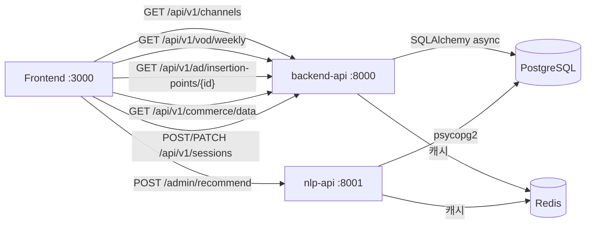

# D-03. 인터페이스 정의서 (API Specification)

> **문서 정보**

| 항목 | 내용 |
|------|------|
| 프로젝트명 | 2026_TV — 차세대 미디어 플랫폼 |
| 문서 번호 | D-03 |
| 문서 버전 | v1.0 |
| 작성일 | 2026-03-04 |
| Base URL | `http://backend-api:8000` (Docker 내부) / `http://YOUR_SERVER_IP:8000` (외부) |

---

## 1. 공통 규격

### 1.1 요청/응답 형식

| 항목 | 규격 |
|------|------|
| 프로토콜 | HTTP/1.1 |
| 데이터 형식 | JSON (`Content-Type: application/json`) |
| 인증 | 없음 (내부 서비스 간 호출, 추후 JWT 추가 예정) |
| 버전 관리 | URL Prefix `/api/v1/` |
| 문자 인코딩 | UTF-8 |

### 1.2 공통 HTTP 상태 코드

| 코드 | 의미 | 사용 케이스 |
|------|------|------------|
| 200 | OK | 정상 조회 |
| 201 | Created | 리소스 생성 성공 |
| 400 | Bad Request | 잘못된 요청 파라미터 |
| 404 | Not Found | 리소스 없음 |
| 422 | Unprocessable Entity | Pydantic 유효성 검사 실패 |
| 500 | Internal Server Error | 서버 오류 |

### 1.3 공통 에러 응답 형식

```json
{
  "detail": "에러 메시지 (한국어)"
}
```

---

## 2. backend-api (`:8000`)

### 2.1 헬스체크

#### `GET /health`

**응답**:
```json
{
  "status": "ok",
  "service": "backend-api"
}
```

---

### 2.2 채널 API

#### `GET /api/v1/channels`

**설명**: 활성 채널 목록 조회 (sort_order 기준 정렬)

**응답 (200)**:
```json
[
  {
    "channel_no": 1,
    "channel_nm": "HV 뉴스",
    "category": "NEWS",
    "stream_url": "https://example.com/hv_news.m3u8",
    "logo_url": null,
    "current_asset_id": null,
    "channel_color": "#c0392b",
    "is_active": "Y",
    "sort_order": 1
  }
]
```

---

#### `GET /api/v1/channels/{channel_no}`

**경로 파라미터**:
| 파라미터 | 타입 | 필수 | 설명 |
|---------|------|------|------|
| `channel_no` | integer | Y | 채널 번호 (1~30) |

**응답 (200)**: 위와 동일한 단일 채널 객체

**응답 (404)**:
```json
{ "detail": "채널 1를 찾을 수 없습니다." }
```

---

#### `PUT /api/v1/channels/{channel_no}/stream`

**설명**: 채널 스트림 URL 업데이트

**쿼리 파라미터**:
| 파라미터 | 타입 | 필수 | 설명 |
|---------|------|------|------|
| `stream_url` | string | Y | 새 HLS 스트림 URL |

---

### 2.3 VOD API

#### `GET /api/v1/vod/weekly`

**설명**: 금주의 무료 VOD 목록 조회 (트랙1)

**쿼리 파라미터**:
| 파라미터 | 타입 | 필수 | 기본값 | 설명 |
|---------|------|------|--------|------|
| `week` | string | N | 현재 주 | YYYYMMDD 형식 |

**응답 (200)**:
```json
[
  {
    "rank_no": 1,
    "asset_id": "VOD_001234",
    "week_start_ymd": "20260303",
    "selection_score": 75.0,
    "selection_reason": "SLOT_KIDS",
    "ad_pipeline_status": "COMPLETED",
    "title": "[키즈] 뽀로로 1화",
    "genre": "키즈/애니",
    "thumbnail_url": "https://cdn.example.com/thumb/001234.jpg",
    "duration_sec": 1800
  }
]
```

---

#### `GET /api/v1/vod/free`

**설명**: 무료 VOD 목록 조회 (트랙2 후보 풀)

**쿼리 파라미터**:
| 파라미터 | 타입 | 필수 | 기본값 | 설명 |
|---------|------|------|--------|------|
| `genre` | string | N | - | 장르 필터 (ilike 검색) |
| `limit` | integer | N | 20 | 최대 100 |
| `offset` | integer | N | 0 | 페이지 오프셋 |

**응답 (200)**:
```json
[
  {
    "asset_id": "VOD_001234",
    "title": "인기 드라마",
    "genre": "드라마",
    "description": "줄거리",
    "thumbnail_url": "https://...",
    "duration_sec": 3600,
    "rating": 8.5,
    "view_count": 123456,
    "is_free_yn": "Y",
    "fast_ad_eligible_yn": "Y"
  }
]
```

---

#### `GET /api/v1/vod/{asset_id}`

**설명**: VOD 상세 정보 조회

**응답 (404)**: `{ "detail": "VOD VOD_001234를 찾을 수 없습니다." }`

---

### 2.4 광고 API

#### `GET /api/v1/ad/insertion-points/{asset_id}`

**설명**: VOD의 FAST 광고 삽입 타임스탬프 목록

**쿼리 파라미터**:
| 파라미터 | 타입 | 필수 | 기본값 | 설명 |
|---------|------|------|--------|------|
| `min_confidence` | float | N | 0.5 | 신뢰도 최소값 (0.0~1.0) |

**응답 (200)**:
```json
[
  {
    "timestamp_sec": 125.5,
    "confidence": 0.87,
    "insert_reason": "LOW_MOTION",
    "display_duration_sec": 4.0,
    "display_position": "OVERLAY_BOTTOM",
    "ad_type": "IMAGE",
    "file_path": "/app/data/ad_assets/VOD_001234/ad_001.png"
  }
]
```

---

### 2.5 커머스 API

#### `GET /api/v1/commerce/data`

**설명**: 0번 채널 TV 커머스 화면 데이터 반환 (메뉴 + 추천채널 + 상품)

**쿼리 파라미터**:
| 파라미터 | 타입 | 필수 | 기본값 |
|---------|------|------|--------|
| `limit` | integer | N | 10 |

**응답 (200)**:
```json
{
  "menus": ["실시간 추천 채널", "VOD", "키즈", "영화", "스포츠", "쇼핑", "약정"],
  "recommendedChannels": [
    {
      "id": "ch_drama",
      "title": "HV 드라마 (추천)",
      "desc": "드라마 · 예능",
      "badge": "LIVE",
      "bg": "#2d1a4a"
    }
  ],
  "products": [
    {
      "id": "PROD_001",
      "name": "LG 65인치 OLED TV",
      "price": 1990000,
      "thumbnail_url": "https://...",
      "is_rental": false,
      "category": "TV > OLED"
    },
    {
      "id": "PROD_002",
      "name": "삼성 공기청정기",
      "price": 35000,
      "thumbnail_url": "https://...",
      "is_rental": true,
      "category": "생활가전 > 공기청정기"
    }
  ]
}
```

**비즈니스 규칙**:
- `price`: `sale_price` 우선, NULL이면 `monthly_rental_fee` 사용
- `is_rental=true`인 경우 프론트엔드에서 가격을 "N원/월" 형식으로 표시
- `Enter` 선택 시: price < 200,000 → 구매 모달, price ≥ 200,000 → 상담 모달

---

### 2.6 쇼핑 API

#### `GET /api/v1/shopping/match`

**설명**: 키워드 기반 상품 매칭 (비전 AI 쇼핑 오버레이용)

**쿼리 파라미터**:
| 파라미터 | 타입 | 필수 | 기본값 |
|---------|------|------|--------|
| `keywords` | string | Y | - | 쉼표 구분 키워드 |
| `limit` | integer | N | 5 | |

#### `GET /api/v1/shopping/products`

**설명**: 상품 목록 조회 (전체)

---

### 2.7 세션 API

#### `POST /api/v1/sessions/start`

**설명**: 시청 세션 시작

**요청 본문**:
```json
{
  "user_id": "user123",
  "session_type": "CHANNEL",
  "channel_no": 1,
  "asset_id": null
}
```

| 필드 | 타입 | 필수 | 설명 |
|------|------|------|------|
| `user_id` | string | Y | 고객 ID |
| `session_type` | string | Y | CHANNEL / VOD_TRACK1 / VOD_TRACK2 |
| `channel_no` | integer | N | 채널 시청 시 필수 |
| `asset_id` | string | N | VOD 시청 시 필수 |

**응답 (201)**:
```json
{
  "session_id": "3fa85f64-5717-4562-b3fc-2c963f66afa6",
  "user_id": "user123",
  "session_type": "CHANNEL",
  "channel_no": 1,
  "asset_id": null,
  "start_dt": "2026-03-04T02:00:00Z"
}
```

---

#### `PATCH /api/v1/sessions/{session_id}/end`

**요청 본문**:
```json
{
  "watch_sec": 1800,
  "ad_impression_count": 3,
  "shopping_click_count": 0
}
```

---

### 2.8 고객 API

#### `GET /api/v1/customers/{user_id}`

**설명**: 고객 프로필 조회

---

## 3. nlp-api (`:8001`)

### 3.1 헬스체크

#### `GET /health`

**응답 (200)**:
```json
{
  "status": "ok",
  "service": "nlp-api",
  "tfidf_ready": true,
  "keybert_ready": true
}
```

---

### 3.2 VOD 추천

#### `POST /admin/recommend`

**설명**: 개인화 VOD 추천 10개 반환

**요청 본문**:
```json
{
  "user_id": "user123",
  "top_n": 10
}
```

**응답 (200)**:
```json
[
  {
    "asset_id": "VOD_001234",
    "score": 0.93,
    "reason": "시청 이력 기반 추천",
    "title": "인기 드라마",
    "thumbnail_url": "https://...",
    "is_kids": false
  },
  {
    "asset_id": "VOD_005678",
    "score": 1.0,
    "reason": "인기 콘텐츠 추천 (시청 이력 없음)",
    "title": "[키즈] 뽀로로",
    "thumbnail_url": "https://...",
    "is_kids": true
  }
]
```

**Cold Start 동작**: 시청 이력 없는 신규 유저의 경우 `score=1.0` 고정, 평점 내림차순 인기 콘텐츠 반환

---

### 3.3 유저 프로필 갱신

#### `POST /admin/update_user_profile`

**쿼리 파라미터**:
| 파라미터 | 타입 | 필수 | 설명 |
|---------|------|------|------|
| `user_id` | string | Y | 갱신할 고객 ID |

**응답 (200)**:
```json
{
  "status": "updated",
  "user_id": "user123",
  "total_watch_sec": 18000,
  "kids_boost_score": 0.350
}
```

---

### 3.4 VOD 벡터化 (전체 재계산)

#### `POST /admin/vod_proc`

**설명**: TB_VOD_META 전체를 TF-IDF로 벡터化하고 tfidf.pkl 저장

**응답 (200)**:
```json
{
  "status": "completed",
  "vod_count": 15000,
  "model_path": "/app/models/tfidf.pkl"
}
```

> ⚠️ 처리 시간이 길 수 있음 (전체 VOD 수에 비례). 운영 환경에서는 오프피크 시간대 실행 권장.

---

## 4. 서비스 간 인터페이스 맵


