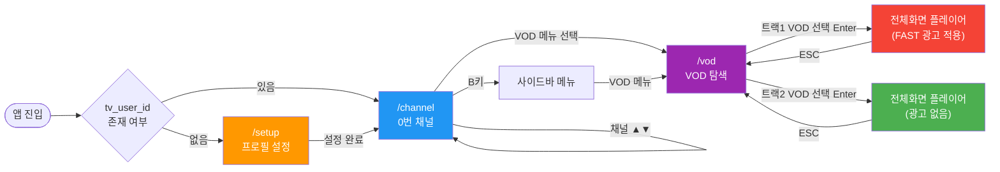

# D-04. UI/UX 화면 설계서 (Storyboard)

> **문서 정보**

| 항목 | 내용 |
|------|------|
| 프로젝트명 | 2026_TV — 차세대 미디어 플랫폼 |
| 문서 번호 | D-04 |
| 문서 버전 | v1.0 |
| 작성일 | 2026-03-04 |
| 플랫폼 | 웹 브라우저 (데스크톱 전용) |
| UI 프레임워크 | Next.js 14 + Tailwind CSS |

---

## 1. 화면 이동 흐름 (Navigation Flow)



---

## 2. 화면 목록

| ID | 화면명 | URL | 컴포넌트 | 진입 조건 |
|----|--------|-----|---------|---------|
| S-01 | 프로필 설정 | `/setup` | `app/setup/page.tsx` | `tv_user_id` 미존재 |
| S-02 | 0번 채널 커머스 | `/channel` | `CommerceChannel` | 기본 진입 |
| S-03 | 실시간 채널 (1~30번) | `/channel` | `ChannelPlayer` | 채널 전환 |
| S-04 | VOD 페이지 | `/vod` | `app/vod/page.tsx` | 사이드바 VOD 선택 |
| S-05 | VOD 전체화면 플레이어 | `/vod` (오버레이) | `VideoPlayer` + `AdOverlay` | VOD 선택 Enter |

---

## 3. 화면 상세 설계

### S-01. 프로필 설정 페이지 (`/setup`)

**목적**: 최초 방문자 사용자 ID 입력

**레이아웃**:
```
┌─────────────────────────────────────────────┐
│                                             │
│          📺  2026 TV                        │
│                                             │
│   ┌─────────────────────────────────┐       │
│   │  사용자 ID를 입력해 주세요       │       │
│   │  ┌───────────────────────────┐  │       │
│   │  │  [텍스트 입력 필드]        │  │       │
│   │  └───────────────────────────┘  │       │
│   │  [ 시작하기 ]                    │       │
│   └─────────────────────────────────┘       │
│                                             │
└─────────────────────────────────────────────┘
```

**기능 명세**:
- 입력값을 `localStorage['tv_user_id']`에 저장
- 완료 후 `/channel`로 자동 리다이렉트
- 빈 값 입력 불가 (유효성 검사)

---

### S-02. 0번 채널 커머스 (`/channel`, channel_no=0)

**레이아웃**:
```
┌─────────────────────────────────────────────────────────────────┐
│ [HELLOVISION LOGO]     HV 쇼핑TV           [B키: 사이드바]       │
├──────┬──────────────────────────────────────────────────────────┤
│      │                                                           │
│ SIDE │    ┌────────────────────────────────────────────────┐    │
│ BAR  │    │  🏪 HV 쇼핑TV                                  │    │
│      │    │                                                │    │
│ ─────│    │  ┌──────┐  ┌──────┐  ┌──────┐  ┌──────┐      │    │
│ 실시간│    │  │ 상품1 │  │ 상품2 │  │ 상품3 │  │ 상품4 │  ...│    │
│ VOD  │    │  │썸네일 │  │썸네일 │  │썸네일 │  │썸네일 │      │    │
│ 키즈 │    │  │ 상품명 │  │ 상품명 │  │ 상품명 │  │ 상품명 │   │    │
│ 영화 │    │  │₩₩₩/월│  │₩₩₩₩₩│  │₩₩₩₩₩│  │₩₩₩₩₩│      │    │
│ 스포 │    │  └──────┘  └──────┘  └──────┘  └──────┘      │    │
│ 쇼핑 │    │                                                │    │
│ 약정 │    │  ─────────────────────────────────────────    │    │
│      │    │  추천 채널: [HV 드라마] [HV 뉴스] [HV 키즈]  │    │
│      │    └────────────────────────────────────────────────┘    │
└──────┴──────────────────────────────────────────────────────────┘
```

**키 이벤트**:
| 키 | 동작 |
|----|------|
| `B` | 사이드바 토글 |
| `←/→` | 상품 카드 포커스 이동 |
| `ENTER` | 상품 선택 → 구매/상담 모달 |
| `▲/▼` | 채널 전환 |

**구매/상담 모달 분기**:
```
price < 200,000원 → PurchaseModal (구매하기 버튼)
price ≥ 200,000원 → ConsultModal (상담 연결 버튼)
```

---

### S-03. 실시간 채널 (1~30번, `/channel`)

**레이아웃**:
```
┌─────────────────────────────────────────────────────────────────┐
│                                                                  │
│                                                                  │
│              [HLS 영상 스트리밍 풀스크린]                         │
│                                                                  │
│                                                                  │
│  ┌─────────────────────────────────────────────────────────┐    │
│  │ [L키: 채널 편성표 오버레이]                              │    │
│  │  CH 1 HV 뉴스    ████████                               │    │
│  │  CH 2 HV 생활경제 ████████                              │    │
│  │  CH 3 HV 드라마  ████████   ← 현재 채널 하이라이트       │    │
│  └─────────────────────────────────────────────────────────┘    │
│                                                                  │
│  (컨트롤 바 없음 — 1~30번 채널)                                   │
└─────────────────────────────────────────────────────────────────┘
```

**키 이벤트**:
| 키 | 동작 |
|----|------|
| `▲/▼` | 채널 전환 (목표 500ms) |
| `L` | 편성표 오버레이 표시/숨김 |
| `ESC` | 편성표 닫기 |

---

### S-04. VOD 페이지 (`/vod`)

**레이아웃** (3단 구성, 수직 스크롤 비활성화):
```
┌─────────────────────────────────────────────────────────────────┐
│ 섹션 1: 광고 배너                                                │
│  ┌───────────────────────────────────────────────────────────┐  │
│  │              [광고 배너 이미지 풀 너비]                    │  │
│  │                              ●○○  (인디케이터)           │  │
│  │  ◀                                                   ▶   │  │
│  └───────────────────────────────────────────────────────────┘  │
├─────────────────────────────────────────────────────────────────┤
│ 섹션 2: 금주의 무료 VOD (트랙1)                     #1~10 • 3/10 │
│  ┌──────┐ ┌──────┐ ┌──────┐ ┌──────┐ ┌──────┐ ┌──────┐        │
│  │썸네일│ │썸네일│▌│썸네일│ │썸네일│ │썸네일│ │썸네일│        │
│  │      │ │      │ │      │ │      │ │      │ │      │        │
│  │ #1   │ │ #2★ │ │ #3   │ │ #4   │ │ #5   │ │ #6   │        │
│  │제목  │ │제목  │ │제목  │ │제목  │ │제목  │ │제목  │        │
│  │장르  │ │장르  │ │장르  │ │장르  │ │장르  │ │장르  │        │
│  └──────┘ └──────┘ └──────┘ └──────┘ └──────┘ └──────┘        │
├─────────────────────────────────────────────────────────────────┤
│ 섹션 3: 추천 VOD (트랙2) — 당신을 위한 무료 VOD       1/10      │
│  ┌──────┐ ┌──────┐ ┌──────┐ ┌──────┐ ┌──────┐ ┌──────┐        │
│  │썸네일│ │썸네일│ │썸네일│ │썸네일│ │썸네일│ │썸네일│        │
│  │추천1 │ │추천2 │ │추천3 │ │추천4 │ │추천5 │ │추천6 │        │
│  └──────┘ └──────┘ └──────┘ └──────┘ └──────┘ └──────┘        │
└─────────────────────────────────────────────────────────────────┘
```

**키 이벤트**:
| 키 | 동작 |
|----|------|
| `▲/▼` | 섹션 이동 (배너 ↔ 트랙1 ↔ 트랙2) |
| `←/→` | 항목 이동 (슬라이딩 윈도우 — 6개 윈도우, 전체 10개) |
| `ENTER` on 트랙1 | 전체화면 VOD 재생 (FAST 광고 포함) |
| `ENTER` on 트랙2 | 전체화면 VOD 재생 (광고 없음) |
| `ENTER` on 배너 | 광고 상세 팝업 모달 |
| `ESC` | 이전 화면으로 |

**슬라이딩 윈도우 동작**:
- 항목 1~6 표시 → 포커스가 6번에서 → 우측 이동 → 2~7번으로 이동
- `3 / 10` 형식으로 현재 포커스 위치 표시

---

### S-05. VOD 전체화면 플레이어

**트랙1 (FAST 광고 적용)**:
```
┌─────────────────────────────────────────────────────────────────┐
│                                                                  │
│                  [VOD 영상 풀스크린 재생]                         │
│                                                                  │
│                                                                  │
│                                                                  │
│  ┌────────────────────────────────────────────────────────────┐ │
│  │ 📢 [광고 이미지/영상]                              ×       │ │  ← OVERLAY_BOTTOM
│  │ 지금 판매 중인 최고의 상품을 만나보세요! LG OLED TV       │ │
│  └────────────────────────────────────────────────────────────┘ │
└─────────────────────────────────────────────────────────────────┘
```

**광고 오버레이 규격**:
| 항목 | 값 |
|------|-----|
| 위치 | 화면 하단 (`OVERLAY_BOTTOM`) |
| 표시 시간 | 4초 |
| 중복 노출 | 동일 타임스탬프 1회만 (재생 회차 내) |
| 트리거 | `currentTime === timestamp_sec` (1초마다 체크) |

**트랙2 (광고 없음)**:
- AdOverlay 미활성화
- 순수 비디오 플레이어만 표시

---

## 4. 컴포넌트 트리

```
app/
├── setup/page.tsx              # S-01 설정 페이지
├── channel/page.tsx            # S-02~03 채널 페이지
│   └── layout 결정: CommerceChannel(0) vs ChannelPlayer(1~30)
└── vod/page.tsx                # S-04~05 VOD 페이지

components/
├── CommerceChannel/            # S-02: 0번 커머스
│   ├── index.tsx               # 메인 컴포넌트
│   ├── ShoppingRow.tsx         # 상품 카드 수평 목록
│   ├── Sidebar.tsx             # 사이드바 메뉴
│   ├── VideoPlayer.tsx         # 추천 채널 비디오
│   ├── PurchaseModal.tsx       # 구매 모달 (< 20만원)
│   └── ConsultModal.tsx        # 상담 모달 (≥ 20만원)
├── ChannelPlayer/              # S-03: 실시간 채널
│   └── index.tsx               # HLS.js 스트리밍 + 키 이벤트
├── AdOverlay/                  # S-05: FAST 광고 오버레이
│   └── index.tsx               # 타임스탬프 기반 표시/숨김
└── ShoppingOverlay/            # 쇼핑 매칭 오버레이 (선택)
    └── index.tsx

hooks/
└── useRemoteFocus.ts           # 리모컨 키 이벤트 통합 관리

lib/
├── api.ts                      # backend-api, nlp-api 클라이언트
└── types.ts                    # 공통 타입 정의
```

---

## 5. 반응형 & 접근성 설계

| 항목 | 설계 |
|------|------|
| 뷰포트 | 데스크톱 전용 (1280px 기준) |
| 입력 방식 | 키보드 (리모컨 에뮬레이션) |
| 포커스 표시 | 선택된 카드에 강조 테두리 (`ring-2 ring-yellow-400`) |
| 자동 슬라이드 | 배너 5초마다 자동 전환 (VOD 재생 중 일시 정지) |
| HLS 오류 처리 | 스트림 로드 실패 시 에러 메시지 표시 |
