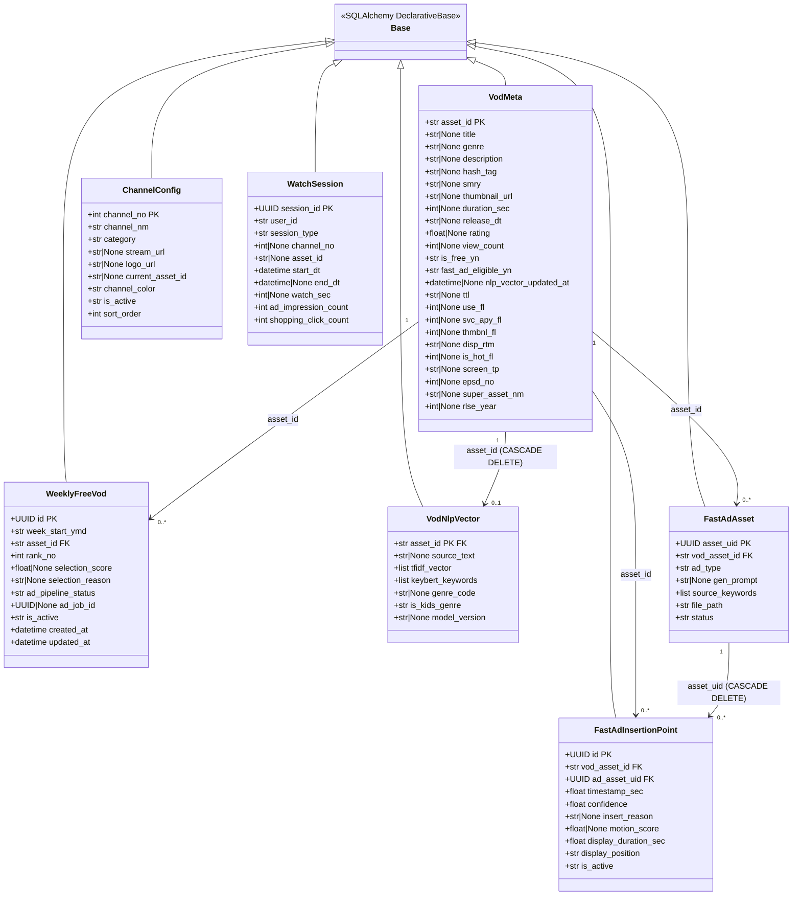
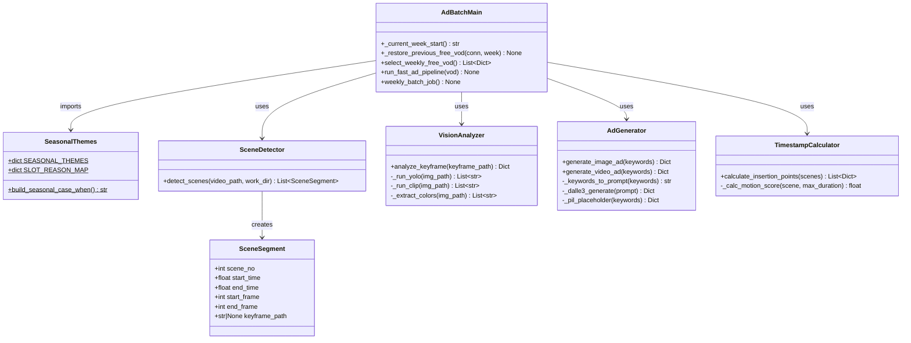
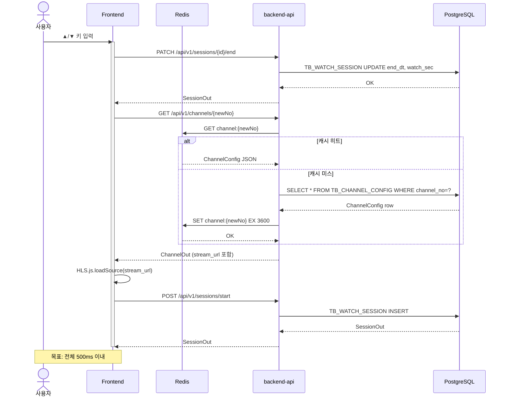
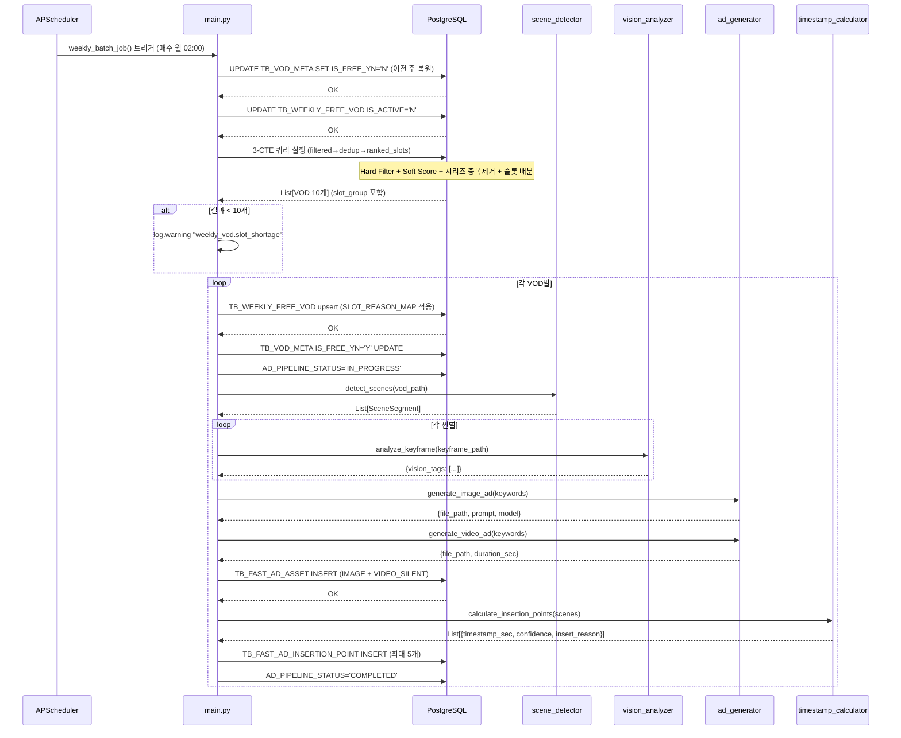
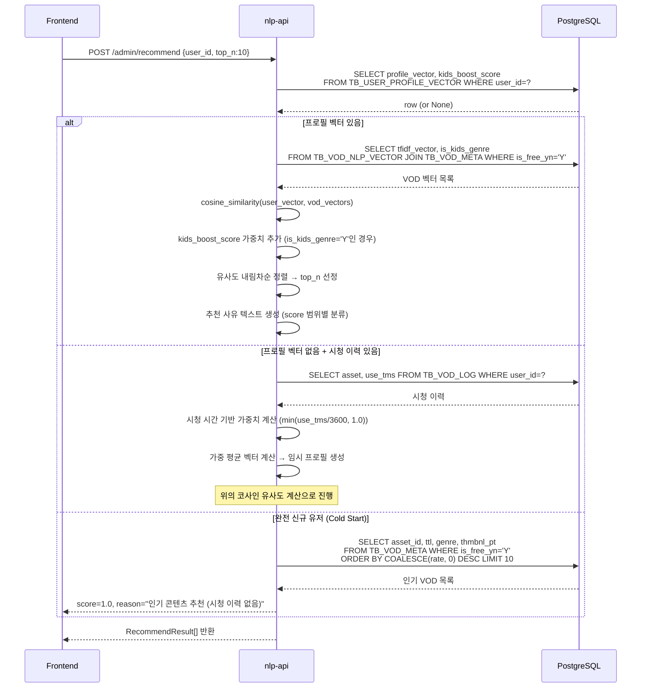
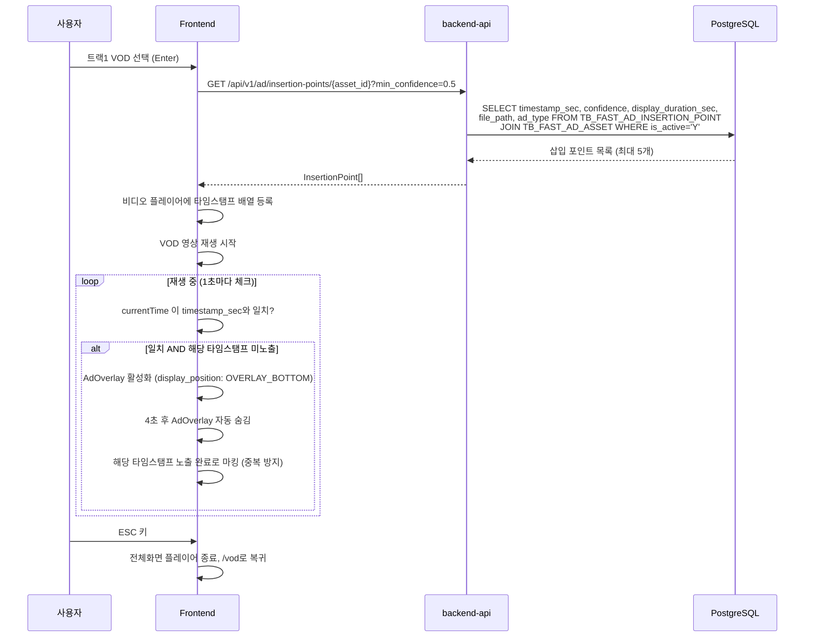

# D-05. 상세 설계서 (Detailed Design)

> **문서 정보**

| 항목 | 내용 |
|------|------|
| 프로젝트명 | 2026_TV — 차세대 미디어 플랫폼 |
| 문서 번호 | D-05 |
| 문서 버전 | v1.0 |
| 작성일 | 2026-03-04 |
| 작성자 | 개발팀 |

---

## 1. 클래스 다이어그램

### 1.1 backend-api ORM 모델



---

### 1.2 ad-batch 모듈 구조



---

## 2. 시퀀스 다이어그램

### 2.1 채널 Zapping 시퀀스



---

### 2.2 금주 VOD 선정 배치 시퀀스 (v2)



---

### 2.3 NLP 개인화 추천 시퀀스



---

### 2.4 FAST 광고 오버레이 재생 시퀀스



---

## 3. 모듈별 처리 로직

### 3.1 `select_weekly_free_vod()` 소프트 점수 계산 알고리즘

```
total_score =
    IS_HOT_FL 점수:    CASE WHEN IS_HOT_FL = 1 THEN 15 ELSE 0 END
  + 화질 점수:         CASE WHEN SCREEN_TP IN ('HD','FHD','UHD') THEN 10 ELSE 0 END
  + 키즈 1화 점수:     CASE WHEN (GENRE LIKE '%키즈%' OR GENRE LIKE '%애니%')
                            AND EPSD_NO = 1 THEN 15 ELSE 0 END
  + 4060 키워드 점수:  CASE WHEN SMRY ~ '(건강|자연인|고향|밥상|다큐|트로트)' THEN 20 ELSE 0 END
  + 시즌 테마 점수:    (seasonal_themes.py → build_seasonal_case_when() 생성)
                       CASE WHEN 현재월 AND 키워드 매칭 THEN 30 ELSE 0 END
```

**최대 가능 점수**: 15 + 10 + 15 + 20 + 30 = **90점**

### 3.2 `calculate_insertion_points()` 알고리즘

```python
# timestamp_calculator.py 핵심 로직
max_duration = max(씬길이 목록)
for 씬 in 씬목록:
    scene_duration = 씬.end_time - 씬.start_time
    motion_score = 1.0 - (scene_duration / max_duration)  # 짧을수록 고움직임
    confidence = 1.0 - motion_score  # 낮은 움직임 = 높은 신뢰도
    timestamp = 씬.start_time + 1.0  # 씬 시작 +1초

# 신뢰도(confidence) 내림차순 정렬 → 상위 5개 선정
# insert_reason 분류:
#   confidence >= 0.8 → "LOW_MOTION"
#   confidence >= 0.5 → "SCENE_BREAK"
#   otherwise         → "QUIET_MOMENT"
```

### 3.3 `build_seasonal_case_when()` 동적 SQL 생성

```python
# seasonal_themes.py
# SEASONAL_THEMES 딕셔너리에서 월별 SQL 자동 생성
for month, keywords in SEASONAL_THEMES.items():
    pattern = "|".join(keywords)  # 예: "추석|명절|가을|단풍|풍성한"
    # WHEN EXTRACT(MONTH FROM CURRENT_DATE) = 9
    #      AND (SMRY ~ '(추석|명절|가을|단풍|풍성한)' OR TTL ~ '(추석|명절|가을)') THEN 30
```

### 3.4 유저 프로필 벡터 생성 (`update_user_profile`)

```
1. TB_VOD_LOG에서 user_id 시청 이력 조회
2. 각 VOD별 가중치 계산:
   watch_weight = min(use_tms / 3600, 1.0)  # 최대 1시간 = 1.0
3. TB_VOD_NLP_VECTOR에서 해당 VOD의 tfidf_vector 조회
4. 가중 평균 벡터 계산:
   profile_vector = Σ(watch_weight × tfidf_vector) / Σ(watch_weight)
5. 키즈 비율 계산:
   kids_ratio = 키즈 시청 시간 / 전체 시청 시간
   kids_boost_score = max(0.1, min(1.0, 0.3 + kids_ratio * 0.7))
6. TB_USER_PROFILE_VECTOR UPSERT
```

---

## 4. 에러 처리 전략

| 에러 유형 | 처리 방법 | 로그 레벨 |
|---------|---------|---------|
| DB 연결 실패 | `pool_pre_ping=True` — 자동 재연결 시도 | ERROR |
| VOD 파일 없음 | 더미 씬 1개로 계속 진행 | WARNING |
| AI API 키 없음 | PIL 플레이스홀더 / ffmpeg 검은화면으로 fallback | WARNING |
| CLIP 로드 실패 | YOLO만으로 계속 진행 | WARNING |
| 슬롯 미달 | 경고 로그 출력 후 선정된 수만큼 진행 | WARNING |
| 파이프라인 실패 | `AD_PIPELINE_STATUS='FAILED'` 기록 + 다음 VOD 계속 | ERROR |
| Redis 연결 실패 | DB 직접 조회로 fallback (캐시 없이 동작) | ERROR |

---

## 5. 환경별 동작 차이

| 환경 | CLIP | AI API | VOD 파일 | 동작 |
|------|------|--------|---------|------|
| 개발 (CPU) | `CLIP_ENABLED=false` | 키 없음 | 없음 | YOLO만 사용, PIL 플레이스홀더, 더미 씬 |
| 스테이징 (GPU) | `CLIP_ENABLED=true` | 테스트 키 | 일부 존재 | 정상 동작 |
| 운영 (GPU) | `CLIP_ENABLED=true` | 실제 키 | 존재 | 전체 파이프라인 |
