# A-02. 프로세스 정의서 — VOD 서비스 (To-Be Process)

> **문서 정보**

| 항목 | 내용 |
|------|------|
| 프로젝트명 | 2026_TV — VOD 서비스 |
| 문서 번호 | A-02 (VOD) |
| 문서 버전 | v1.0 |
| 작성일 | 2026-03-04 |
| **범위** | **VOD 탐색·재생 / NLP 추천 / FAST 광고 배치 / TF-IDF 모델 갱신** |

---

## 1. VOD 서비스 전체 흐름

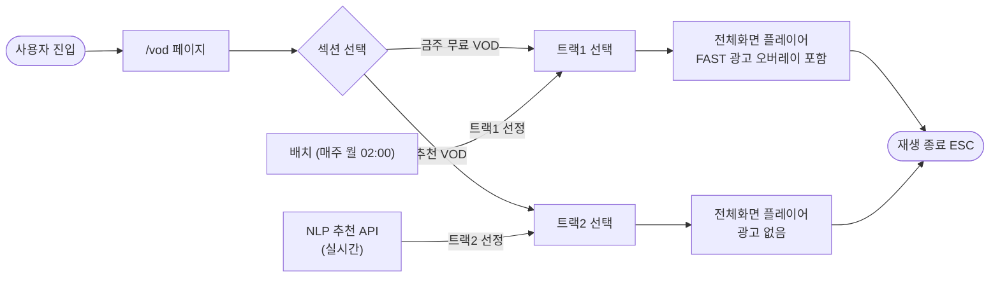

<!-- mermaid-img-A02_Process_VOD-1 -->
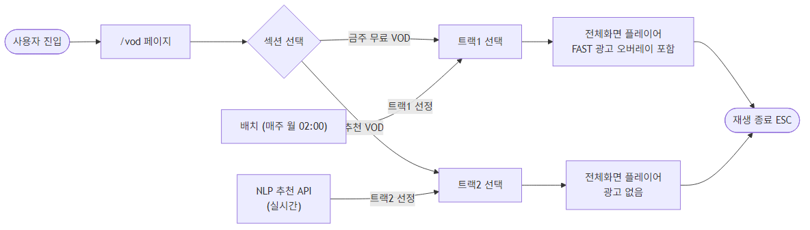

---

## 2. VOD 탐색 및 재생 프로세스 (P-VOD-01)

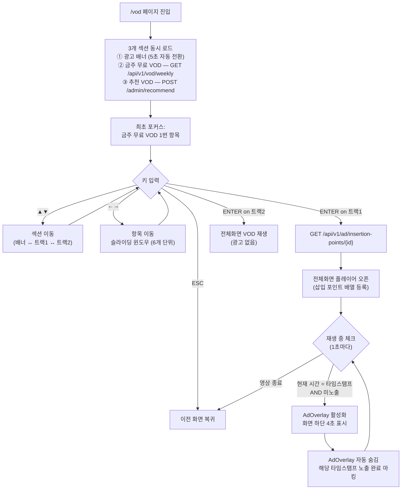

<!-- mermaid-img-A02_Process_VOD-2 -->
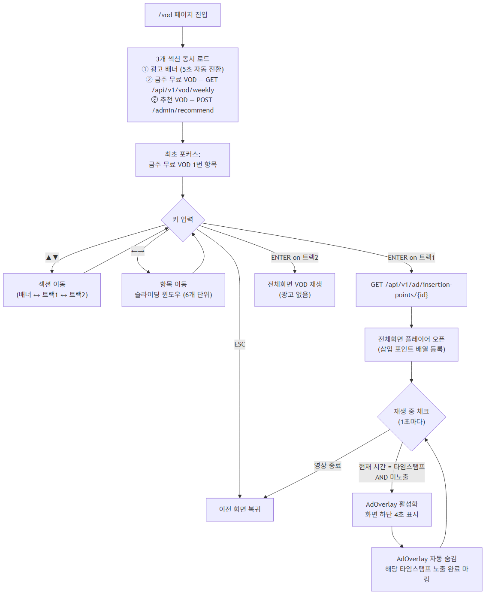

---

## 3. FAST 광고 배치 프로세스 (P-VOD-02) — 매주 월요일 02:00

```mermaid
flowchart TD
    TRIGGER["APScheduler 트리거<br/>매주 월 02:00 KST (AD_BATCH_CRON)"] --> RESTORE

    subgraph STEP0 ["① 이전 주 정리"]
        RESTORE["IS_FREE_YN='N' 복원<br/>(현재 주 선정 VOD 제외)"] --> DEACTIVATE
        DEACTIVATE["TB_WEEKLY_FREE_VOD IS_ACTIVE='N'"]
    end

    DEACTIVATE --> STEP1_START

    subgraph STEP1 ["② 트랙1 VOD 선정 (3-CTE 쿼리)"]
        STEP1_START["Hard Filter\nUSE_FL=1 · SVC_APY_FL=1\nTHMBNL_FL=1 · IS_FREE_YN='N'\nDISP_RTM ≥ '00:20:00'"] --> SOFT_SCORE
        SOFT_SCORE["Soft Score 계산\n인기작 +15 / 고화질 +10\n키즈1화 +15 / 4060키워드 +20\n월별시즌테마 +30"] --> DEDUP
        DEDUP["시리즈 중복 제거\nSUPER_ASSET_NM 기준 최고점 1편"] --> SLOT
        SLOT["슬롯 배분\nKIDS ≤3 / DOCU ≤4 / ENT ≤2 / ETC ≤1"]
    end

    SLOT --> CHECK{"선정 수 < 10?"}
    CHECK --> |"예"| WARN["log.warning:<br/>weekly_vod.slot_shortage"]
    CHECK --> |"아니오"| UPSERT
    WARN --> UPSERT

    UPSERT["TB_WEEKLY_FREE_VOD upsert\nSELECTION_REASON = SLOT_xxx\nIS_FREE_YN='Y' 갱신"] --> PIPELINE_LOOP

    subgraph PIPELINE_LOOP ["③ 각 VOD별 FAST 광고 파이프라인 (4단계)"]
        S1["1. scene_detector.py\nPySceneDetect (threshold=30.0)\nffmpeg 키프레임 PNG 추출"] --> S2
        S2["2. vision_analyzer.py\nYOLO v8n 객체 감지 (conf≥0.5)\n+ CLIP 컨텍스트 태그 (CLIP_ENABLED=true 시)\n+ PIL 색상 추출\n→ vision_tags (최대 10개)"] --> S3
        S3["3. ad_generator.py\nDALL-E 3 → 이미지 광고 (1024×1024 PNG)\nRunwayML/Kling → 영상 광고 (4초 MP4 무음)\n* API 키 없음 → PIL/ffmpeg fallback"] --> S4
        S4["4. timestamp_calculator.py\nmotion_score 기반 저움직임 구간 탐지\n삽입 포인트 최대 5개 선정\n(씬시작 +1.0초, 신뢰도 내림차순)"]
    end

    S4 --> DONE["AD_PIPELINE_STATUS='COMPLETED'\nTB_FAST_AD_INSERTION_POINT 저장"]
```

<!-- mermaid-img-A02_Process_VOD-3 -->
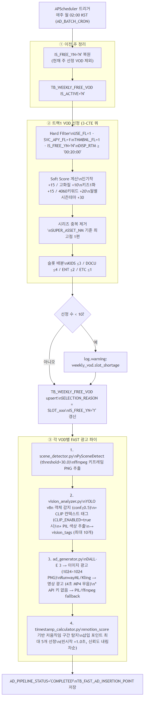

---

## 4. NLP 개인화 추천 프로세스 (P-VOD-03)

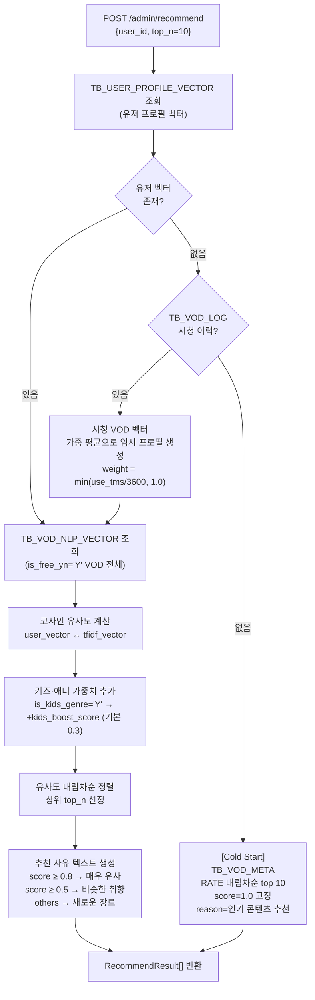

<!-- mermaid-img-A02_Process_VOD-4 -->
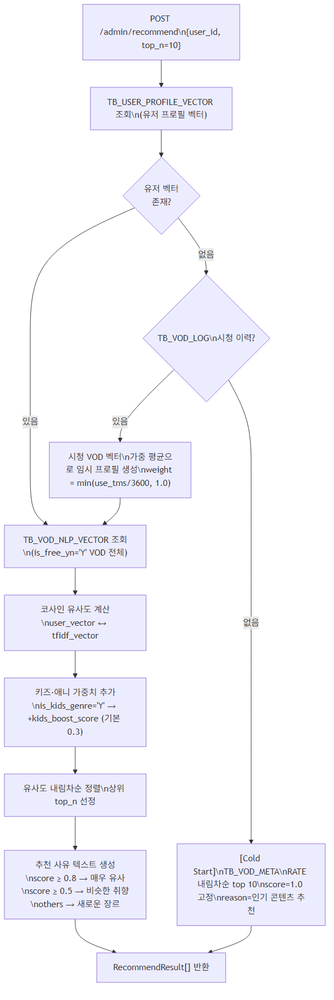

---

## 5. TF-IDF 모델 갱신 프로세스 (P-VOD-04) — 관리자 수동 실행

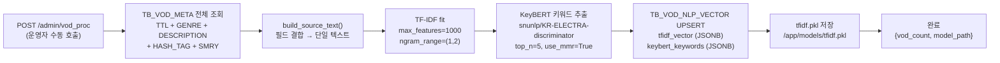

<!-- mermaid-img-A02_Process_VOD-5 -->
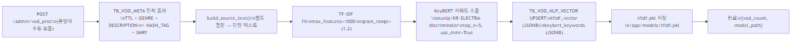

---

## 6. 유저 프로필 벡터 갱신 프로세스 (P-VOD-05)

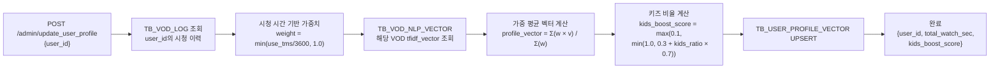

<!-- mermaid-img-A02_Process_VOD-6 -->
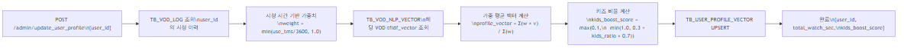

