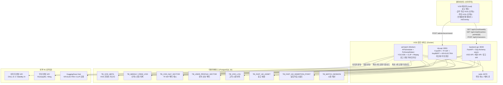
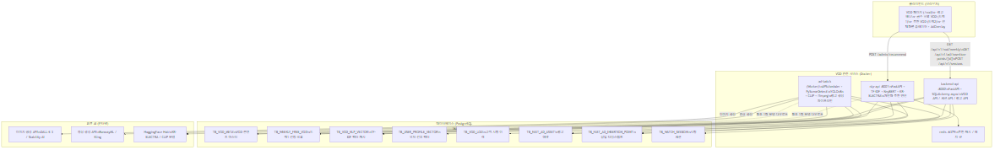
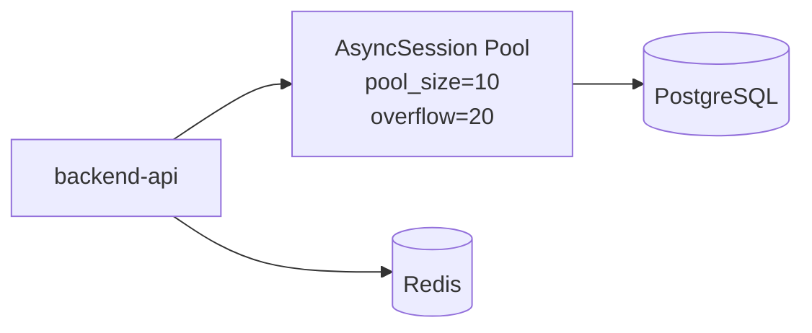
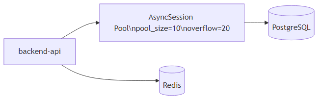
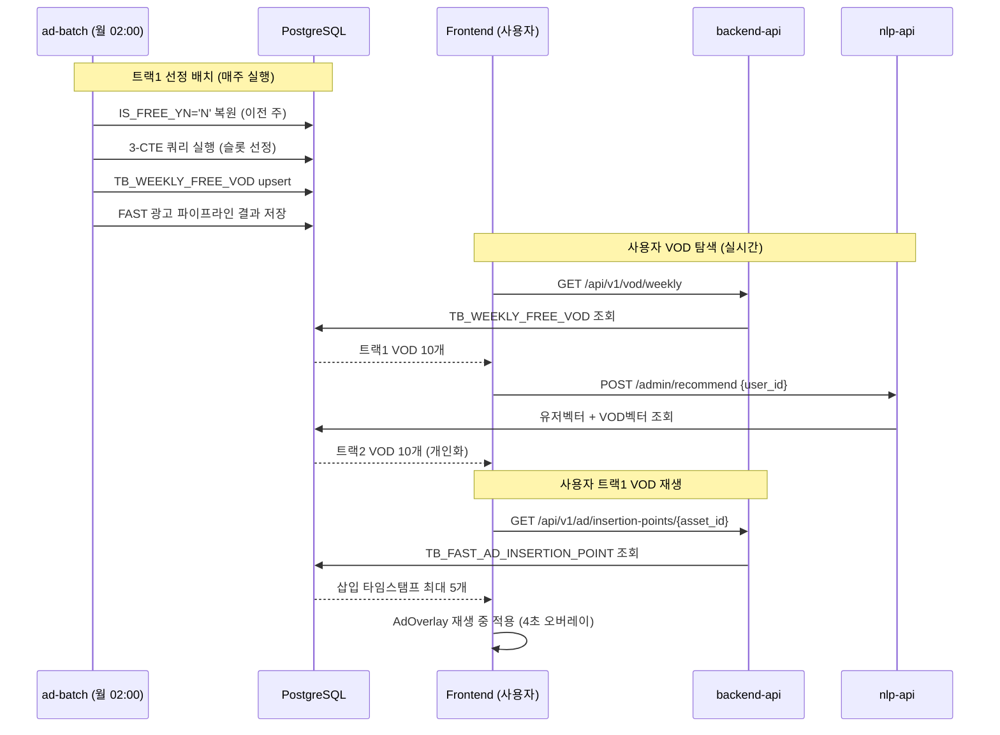
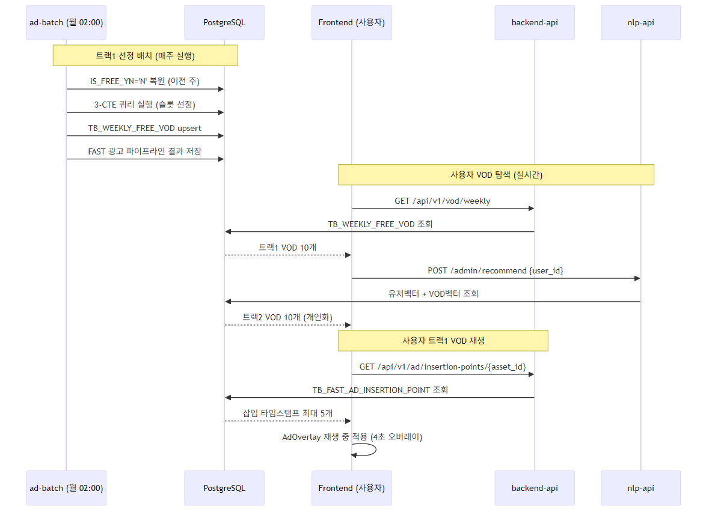

# D-01. 시스템 아키텍처 설계서 — VOD 서비스 (SAD)

> **문서 정보**

| 항목 | 내용 |
|------|------|
| 프로젝트명 | 2026_TV — VOD 서비스 |
| 문서 번호 | D-01 (VOD) |
| 문서 버전 | v1.0 |
| 작성일 | 2026-03-04 |
| **범위** | **VOD 큐레이션 · 개인화 추천 · FAST 광고** |

---

## 1. VOD 서비스 구성도



<!-- mermaid-img-D01_SAD_VOD-1 -->



---

## 2. 서비스별 기술 스택

| 서비스 | 역할 | 기술 | 포트 |
|--------|------|------|------|
| **frontend** | VOD 페이지 UI + AdOverlay | Next.js 14, TypeScript, Tailwind CSS | 3000 |
| **backend-api** | VOD / 광고 / 세션 REST API | FastAPI, SQLAlchemy async, Pydantic v2, asyncpg | 8000 |
| **nlp-api** | 개인화 추천 엔진 | FastAPI, scikit-learn TF-IDF, KeyBERT, KR-ELECTRA | 8001 |
| **ad-batch** | 큐레이션 배치 + 광고 파이프라인 | APScheduler, PySceneDetect, YOLOv8n, CLIP, ffmpeg | - (Worker) |
| **redis** | 추천 캐시 | Redis 7 Alpine | 6379 |
| **PostgreSQL** | 데이터 저장 | PostgreSQL 16 (외부 운영 서버) | 5432 |

---

## 3. 서비스 상세 설계

### 3.1 backend-api — VOD 관련 엔드포인트

| 메서드 | 경로 | 기능 |
|--------|------|------|
| GET | `/api/v1/vod/weekly` | 금주 무료 VOD 목록 (트랙1) |
| GET | `/api/v1/vod/free` | 무료 VOD 전체 목록 (트랙2 후보 풀) |
| GET | `/api/v1/vod/{asset_id}` | VOD 상세 정보 |
| GET | `/api/v1/ad/insertion-points/{asset_id}` | FAST 광고 삽입 타임스탬프 목록 |
| POST | `/api/v1/sessions/start` | VOD 시청 세션 시작 |
| PATCH | `/api/v1/sessions/{id}/end` | VOD 시청 세션 종료 |



<!-- mermaid-img-D01_SAD_VOD-2 -->



---

### 3.2 nlp-api — 개인화 추천 엔진

**서비스 기동 순서 (lifespan)**:
```
1. /app/models/tfidf.pkl 로드
   → 파일 없으면 tfidf_ready=false (POST /admin/vod_proc 필요)
2. KR-ELECTRA(KeyBERT) 사전 워밍업 (초기 1회)
3. API 서버 기동 (GET /health → tfidf_ready 상태 반환)
```

**추천 처리 흐름**:
```
POST /admin/recommend → 유저벡터 조회 → 코사인 유사도 → kids_boost → top 10
```

**Cold Start 정책**:
```
유저벡터 있음 → 개인화 추천
유저벡터 없음 + 시청이력 있음 → 임시 프로필 생성 → 개인화 추천
시청이력 없음 → RATE 내림차순 top 10 (인기 콘텐츠)
```

---

### 3.3 ad-batch — 큐레이션 + 광고 파이프라인

**파일 구조**:
```
ad-batch/app/
├── main.py              # 스케줄러 진입점 + v2 CTE 쿼리 + 복원 로직
├── seasonal_themes.py   # 12개월 시즌 테마 딕셔너리 + SQL CASE-WHEN 생성 [v2 신규]
├── scene_detector.py    # PySceneDetect + ffmpeg 키프레임 추출
├── vision_analyzer.py   # YOLOv8n + CLIP + PIL 색상 추출
├── ad_generator.py      # DALL-E 3 이미지 + Runway 영상 생성
└── timestamp_calculator.py  # motion_score → 삽입 포인트 선정
```

**배치 스케줄**: `AD_BATCH_CRON` (기본: `0 2 * * 1`, 매주 월 02:00 KST)

---

## 4. 데이터 흐름



<!-- mermaid-img-D01_SAD_VOD-3 -->



---

## 5. Docker 볼륨 설계 (VOD 관련)

| 볼륨명 | 마운트 경로 | 용도 |
|--------|-----------|------|
| `nlp_models` | `/app/models` (nlp-api) | `tfidf.pkl` 영속화 |
| `batch_models` | `/app/models` (ad-batch) | `yolov8n.pt` + CLIP 캐시 |
| `ad_assets` | `/app/data/ad_assets` (ad-batch) | 생성된 이미지/영상 광고 에셋 |
| `vod_data` | `/app/data/vod` (ad-batch, 읽기전용) | 원본 VOD 파일 |

---

## 6. 가용성 및 Fallback 전략

| 장애 유형 | 처리 방법 |
|---------|---------|
| tfidf.pkl 없음 | 경고 로그 + `/admin/vod_proc` 실행 필요 안내 |
| CLIP 로드 실패 | YOLO만으로 계속 진행 |
| AI API 키 없음 | PIL 플레이스홀더(이미지) / ffmpeg 검은화면(영상)으로 fallback |
| VOD 파일 없음 | 더미 씬 1개 생성 → 파이프라인 계속 진행 |
| 슬롯 10개 미달 | `weekly_vod.slot_shortage` 경고 로그 + 선정된 수만 기록 |
| Redis 연결 실패 | DB 직접 조회 (캐시 없이 동작) |
