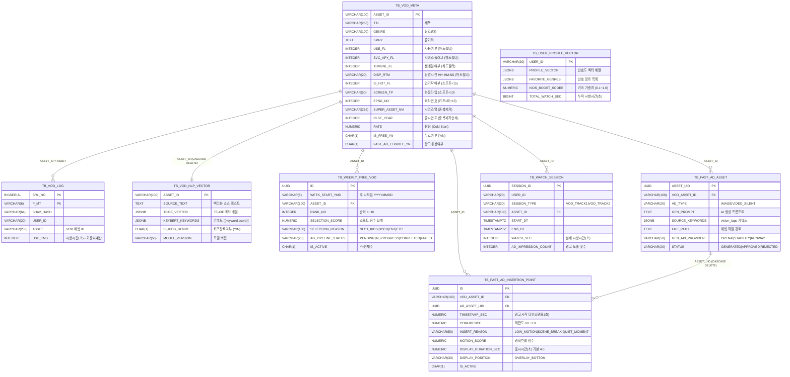
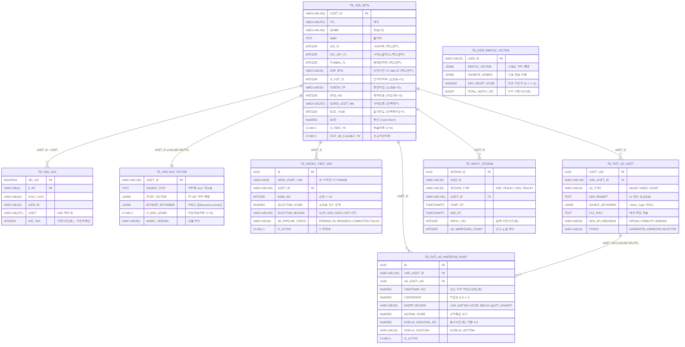

# D-02. 데이터베이스 설계서 — VOD 서비스 (ERD & Table Specification)

> **문서 정보**

| 항목 | 내용 |
|------|------|
| 프로젝트명 | 2026_TV — VOD 서비스 |
| 문서 번호 | D-02 (VOD) |
| 문서 버전 | v1.0 |
| 작성일 | 2026-03-04 |
| **포함 테이블** | TB_VOD_META · TB_VOD_LOG · TB_VOD_NLP_VECTOR · TB_USER_PROFILE_VECTOR · TB_WEEKLY_FREE_VOD · TB_FAST_AD_ASSET · TB_FAST_AD_INSERTION_POINT · TB_WATCH_SESSION (VOD 세션) |
| **제외 테이블** | TB_CHANNEL_CONFIG · TB_PROD_INFO · TB_CUST_INFO |

---

## 1. ERD (VOD 서비스 범위)

<!-- mermaid-img-D02_Database_VOD-1 -->

---

## 2. 테이블 상세 명세

### 2.1 TB_VOD_META — VOD 콘텐츠 마스터

**v2 큐레이션 관련 컬럼 중심 정리** (전체 컬럼은 ddl.sql 참조):

| 컬럼명 | 타입 | NULL | 기본값 | 역할 |
|--------|------|------|--------|------|
| `ASSET_ID` | VARCHAR(100) | NOT NULL | - | PK |
| `TTL` | VARCHAR(255) | NULL | - | NLP 벡터화 소스, 시즌 테마 검색 |
| `GENRE` | VARCHAR(100) | NULL | - | **슬롯 분류 기준** |
| `SMRY` | TEXT | NULL | - | NLP 벡터화 소스, 4060 키워드 검색 |
| `DESCRIPTION` | TEXT | NULL | - | NLP 벡터화 소스 |
| `HASH_TAG` | TEXT | NULL | - | NLP 벡터화 소스 |
| `USE_FL` | INTEGER | NULL | - | **하드 필터** (=1 조건) |
| `SVC_APY_FL` | INTEGER | NULL | - | **하드 필터** (=1 조건) |
| `THMBNL_FL` | INTEGER | NULL | - | **하드 필터** (=1 조건) |
| `DISP_RTM` | VARCHAR(20) | NULL | - | **하드 필터** (≥'00:20:00') |
| `IS_HOT_FL` | INTEGER | NULL | - | 소프트 점수 +15 |
| `SCREEN_TP` | VARCHAR(50) | NULL | - | 소프트 점수 +10 (HD/FHD/UHD) |
| `EPSD_NO` | INTEGER | NULL | - | 키즈 1화 유도 소프트 점수 +15 |
| `SUPER_ASSET_NM` | VARCHAR(255) | NULL | - | **시리즈 중복 제거 기준** |
| `RLSE_YEAR` | INTEGER | NULL | - | 중복 제거 시 우선순위 |
| `RATE` | NUMERIC | NULL | - | Cold Start 정렬 기준 |
| `IS_FREE_YN` | CHAR(1) | NOT NULL | `'N'` | 선정 후 Y, 배치 전 N으로 복원 |
| `FAST_AD_ELIGIBLE_YN` | CHAR(1) | NOT NULL | `'N'` | 트랙1 선정 후 Y 설정 |
| `NLP_VECTOR_UPDATED_AT` | TIMESTAMPTZ | NULL | - | NLP 벡터 갱신 일시 |

---

### 2.2 TB_VOD_LOG — 고객별 VOD 시청 이력

| 컬럼명 | 타입 | 설명 |
|--------|------|------|
| `SRL_NO` | BIGSERIAL | 일련번호 (PK1) |
| `P_MT` | VARCHAR(6) | 데이터 생성 월 YYYYMM (PK2) |
| `USER_ID` | VARCHAR(20) | 고객ID |
| `ASSET` | VARCHAR(255) | VOD 에셋 ID → TB_VOD_META |
| `ASSET_NM` | VARCHAR(255) | 콘텐츠명 |
| `USE_TMS` | INTEGER | **실제 시청시간(초) — 유저 프로필 가중치 계산 핵심** |
| `STRT_DT` | VARCHAR(14) | 시청 시작일시 YYYYMMDDHHMISS |

> **유저 가중치 계산**: `weight = min(USE_TMS / 3600, 1.0)` (최대 1시간 = 1.0)

---

### 2.3 TB_USER_PROFILE_VECTOR — 유저 NLP 프로필 벡터

| 컬럼명 | 타입 | NULL | 기본값 | 설명 |
|--------|------|------|--------|------|
| `USER_ID` | VARCHAR(20) | NOT NULL | - | PK |
| `PROFILE_VECTOR` | JSONB | NOT NULL | `'[]'` | TF-IDF 공간 유저 선호 벡터 |
| `FAVORITE_GENRES` | JSONB | NOT NULL | `'[]'` | 선호 장르 목록 `[{genre, score}]` |
| `FAVORITE_KEYWORDS` | JSONB | NOT NULL | `'[]'` | 선호 키워드 목록 `[{keyword, weight}]` |
| `KIDS_BOOST_SCORE` | NUMERIC(4,3) | NOT NULL | `0.300` | 키즈/애니 추천 가중치 **(최소 0.1 보장 — 비즈니스 룰)** |
| `RECENT_GENRES` | JSONB | NOT NULL | `'[]'` | 최근 30일 시청 장르 상위 5개 |
| `TOTAL_WATCH_SEC` | BIGINT | NOT NULL | `0` | 누적 시청 시간(초) — 프로필 신뢰도 |

> **KIDS_BOOST_SCORE 계산**: `max(0.1, min(1.0, 0.3 + kids_ratio × 0.7))`
> 키즈 시청 비율이 0이어도 최소 0.1 보장 (키즈 추천 완전 소거 방지)

---

### 2.4 TB_VOD_NLP_VECTOR — VOD NLP 벡터 캐시

| 컬럼명 | 타입 | NULL | 설명 |
|--------|------|------|------|
| `ASSET_ID` | VARCHAR(100) | NOT NULL | PK, FK → TB_VOD_META (CASCADE DELETE) |
| `SOURCE_TEXT` | TEXT | NULL | 벡터화에 사용된 소스 텍스트 (TTL+GENRE+DESC+HASH_TAG+SMRY) |
| `TFIDF_VECTOR` | JSONB | NOT NULL | TF-IDF 벡터 배열 |
| `KEYBERT_KEYWORDS` | JSONB | NOT NULL | `[{keyword, score}]` |
| `GENRE_CODE` | VARCHAR(100) | NULL | 빠른 키즈 필터링용 |
| `IS_KIDS_GENRE` | CHAR(1) | NOT NULL | Y=키즈/애니 장르 (kids_boost 적용 여부 식별) |
| `MODEL_VERSION` | VARCHAR(50) | NULL | 모델 버전 (재벡터화 필요 판단) |

---

### 2.5 TB_WEEKLY_FREE_VOD — 금주의 무료 VOD (트랙1)

| 컬럼명 | 타입 | NULL | 기본값 | 설명 |
|--------|------|------|--------|------|
| `ID` | UUID | NOT NULL | `uuid_generate_v4()` | PK |
| `WEEK_START_YMD` | VARCHAR(8) | NOT NULL | - | 주 시작일 (매주 월요일 YYYYMMDD) |
| `ASSET_ID` | VARCHAR(100) | NOT NULL | - | FK → TB_VOD_META |
| `RANK_NO` | INTEGER | NOT NULL | - | 선정 순위 (1~10, UNIQUE per week) |
| `SELECTION_SCORE` | NUMERIC(10,4) | NULL | - | v2 소프트 점수 합계 (최대 90점) |
| `SELECTION_REASON` | VARCHAR(100) | NULL | - | `SLOT_KIDS` / `SLOT_DOCU` / `SLOT_ENT` / `SLOT_ETC` |
| `AD_PIPELINE_STATUS` | VARCHAR(20) | NOT NULL | `'PENDING'` | PENDING → IN_PROGRESS → COMPLETED / FAILED |
| `IS_ACTIVE` | CHAR(1) | NOT NULL | `'Y'` | Y=현재 주, N=이전 주 (배치 시 N으로 변경) |

**UNIQUE 제약**: `(WEEK_START_YMD, ASSET_ID)` · `(WEEK_START_YMD, RANK_NO)`

---

### 2.6 TB_FAST_AD_ASSET — FAST 광고 에셋

| 컬럼명 | 타입 | NULL | 설명 |
|--------|------|------|------|
| `ASSET_UID` | UUID | NOT NULL | PK |
| `VOD_ASSET_ID` | VARCHAR(100) | NOT NULL | FK → TB_VOD_META |
| `AD_TYPE` | VARCHAR(20) | NOT NULL | `IMAGE` / `VIDEO_SILENT` |
| `GEN_PROMPT` | TEXT | NULL | AI 생성에 사용된 프롬프트 |
| `SOURCE_KEYWORDS` | JSONB | NOT NULL | vision_tags 기반 키워드 배열 |
| `FILE_PATH` | TEXT | NOT NULL | 파일 경로 (`/app/data/ad_assets/...`) |
| `FILE_SIZE_BYTES` | BIGINT | NULL | 파일 크기 |
| `DURATION_SEC` | NUMERIC(6,2) | NULL | 영상 길이 (VIDEO_SILENT 전용, 목표: 3~5초) |
| `WIDTH_PX` / `HEIGHT_PX` | INTEGER | NULL | 해상도 (IMAGE: 1024×1024) |
| `GEN_API_PROVIDER` | VARCHAR(50) | NULL | OPENAI / STABILITY / RUNWAY |
| `GEN_API_MODEL` | VARCHAR(100) | NULL | dall-e-3, stable-diffusion-xl 등 |
| `STATUS` | VARCHAR(20) | NOT NULL | GENERATED / APPROVED / REJECTED / EXPIRED |

---

### 2.7 TB_FAST_AD_INSERTION_POINT — 광고 삽입 타임스탬프

| 컬럼명 | 타입 | NULL | 기본값 | 설명 |
|--------|------|------|--------|------|
| `ID` | UUID | NOT NULL | - | PK |
| `VOD_ASSET_ID` | VARCHAR(100) | NOT NULL | - | FK → TB_VOD_META |
| `AD_ASSET_UID` | UUID | NOT NULL | - | FK → TB_FAST_AD_ASSET (CASCADE DELETE) |
| `TIMESTAMP_SEC` | NUMERIC(10,3) | NOT NULL | - | 광고 오버레이 시작 타임스탬프(초) |
| `CONFIDENCE` | NUMERIC(4,3) | NOT NULL | - | 삽입 적합도 (0.0~1.0, 높을수록 이탈율 낮은 구간) |
| `INSERT_REASON` | VARCHAR(50) | NULL | - | LOW_MOTION / SCENE_BREAK / QUIET_MOMENT |
| `MOTION_SCORE` | NUMERIC(6,4) | NULL | - | 광학 흐름 점수 (낮을수록 저움직임 = 광고 적합) |
| `DISPLAY_DURATION_SEC` | NUMERIC(6,2) | NOT NULL | `4.0` | 광고 표시 시간(초) |
| `DISPLAY_POSITION` | VARCHAR(30) | NOT NULL | `'OVERLAY_BOTTOM'` | 표시 위치 |
| `IS_ACTIVE` | CHAR(1) | NOT NULL | `'Y'` | 활성 여부 |

**조회 API 조건**: `IS_ACTIVE='Y' AND CONFIDENCE >= min_confidence` + `TIMESTAMP_SEC ASC` 정렬

---

### 2.8 TB_WATCH_SESSION — VOD 시청 세션 (VOD 관련)

| 컬럼명 | 타입 | 설명 |
|--------|------|------|
| `SESSION_ID` | UUID | PK |
| `USER_ID` | VARCHAR(20) | 고객ID |
| `SESSION_TYPE` | VARCHAR(20) | `VOD_TRACK1` / `VOD_TRACK2` |
| `ASSET_ID` | VARCHAR(100) | FK → TB_VOD_META |
| `START_DT` | TIMESTAMPTZ | 시청 시작 일시 |
| `END_DT` | TIMESTAMPTZ | 시청 종료 일시 |
| `WATCH_SEC` | INTEGER | 실제 시청 시간(초) |
| `AD_IMPRESSION_COUNT` | INTEGER | FAST 광고 오버레이 노출 횟수 (트랙1 전용) |
| `SHOPPING_CLICK_COUNT` | INTEGER | 쇼핑 클릭 횟수 (VOD에서는 미사용, 기본 0) |

---

## 3. 인덱스 설계 (VOD 범위)

| 인덱스명 | 테이블 | 컬럼 | 용도 |
|---------|--------|------|------|
| `IDX_VOD_META_FREE` | TB_VOD_META | `IS_FREE_YN` | 무료 VOD 필터링 |
| `IDX_VOD_META_FAST_AD` | TB_VOD_META | `FAST_AD_ELIGIBLE_YN` | FAST광고 대상 조회 |
| `IDX_WEEKLY_FREE_VOD_WEEK` | TB_WEEKLY_FREE_VOD | `WEEK_START_YMD, IS_ACTIVE` | 금주 VOD 조회 |
| `IDX_FAST_AD_INSERT_VOD` | TB_FAST_AD_INSERTION_POINT | `VOD_ASSET_ID, IS_ACTIVE, TIMESTAMP_SEC` | 재생 중 타임스탬프 조회 |
| `IDX_FAST_AD_INSERT_CONFIDENCE` | TB_FAST_AD_INSERTION_POINT | `VOD_ASSET_ID, CONFIDENCE DESC` | 신뢰도 필터 조회 |
| `IDX_VOD_NLP_VECTOR_KIDS` | TB_VOD_NLP_VECTOR | `IS_KIDS_GENRE` | 키즈 VOD 필터링 |
| `IDX_VOD_NLP_VECTOR_GENRE` | TB_VOD_NLP_VECTOR | `GENRE_CODE` | 장르별 벡터 조회 |
| `IDX_WATCH_SESSION_USER` | TB_WATCH_SESSION | `USER_ID, START_DT DESC` | 유저 시청 이력 조회 |
| `IDX_WATCH_SESSION_ASSET` | TB_WATCH_SESSION | `ASSET_ID, START_DT DESC` | VOD별 시청 이력 조회 |
