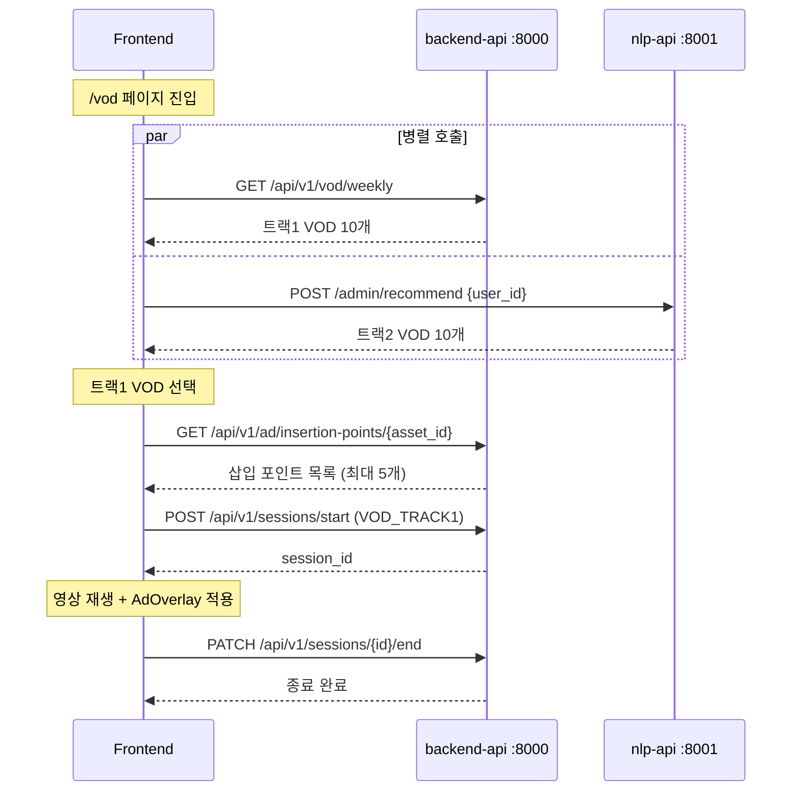
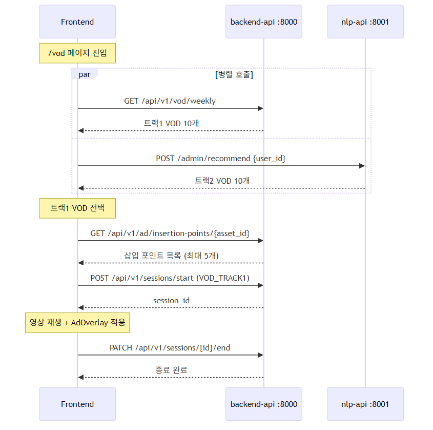

# D-03. 인터페이스 정의서 — VOD 서비스 (API Specification)

> **문서 정보**

| 항목 | 내용 |
|------|------|
| 프로젝트명 | 2026_TV — VOD 서비스 |
| 문서 번호 | D-03 (VOD) |
| 문서 버전 | v1.0 |
| 작성일 | 2026-03-04 |
| **포함 API** | **VOD 조회 · FAST 광고 · 세션(VOD) · NLP 추천** |
| **제외 API** | **채널 · 커머스 · 쇼핑 · 고객** |
| Base URL | `http://backend-api:8000` / `http://nlp-api:8001` |

---

## 1. 공통 규격

| 항목 | 규격 |
|------|------|
| 프로토콜 | HTTP/1.1, JSON |
| 버전 관리 | URL Prefix: `/api/v1/` (backend-api), `/admin/` (nlp-api) |
| 인코딩 | UTF-8 |

**공통 에러 응답**:
```json
{ "detail": "에러 메시지 (한국어)" }
```

| 코드 | 의미 |
|------|------|
| 200 | 정상 조회 |
| 201 | 생성 성공 |
| 404 | 리소스 없음 |
| 422 | 유효성 검사 실패 |

---

## 2. VOD API (backend-api `:8000`)

### 2.1 금주 무료 VOD 목록 조회 (트랙1)

```
GET /api/v1/vod/weekly
```

**쿼리 파라미터**:

| 파라미터 | 타입 | 필수 | 기본값 | 설명 |
|---------|------|------|--------|------|
| `week` | string | N | 현재 주 | YYYYMMDD 형식의 주 시작일 (월요일 기준) |

**응답 (200)**:
```json
[
  {
    "rank_no": 1,
    "asset_id": "VOD_001234",
    "week_start_ymd": "20260303",
    "selection_score": 75.0,
    "selection_reason": "SLOT_KIDS",
    "ad_pipeline_status": "COMPLETED",
    "title": "[키즈] 뽀로로와 친구들 1화",
    "genre": "키즈/애니",
    "thumbnail_url": "https://cdn.example.com/thumb/001234.jpg",
    "duration_sec": 1800
  },
  {
    "rank_no": 2,
    "asset_id": "VOD_005678",
    "week_start_ymd": "20260303",
    "selection_score": 65.0,
    "selection_reason": "SLOT_DOCU",
    "ad_pipeline_status": "COMPLETED",
    "title": "자연의 신비 다큐",
    "genre": "다큐멘터리",
    "thumbnail_url": "https://cdn.example.com/thumb/005678.jpg",
    "duration_sec": 3600
  }
]
```

**응답 필드 설명**:

| 필드 | 설명 |
|------|------|
| `rank_no` | 선정 순위 (1~10) |
| `selection_reason` | 슬롯 코드: `SLOT_KIDS` / `SLOT_DOCU` / `SLOT_ENT` / `SLOT_ETC` |
| `ad_pipeline_status` | `PENDING` / `IN_PROGRESS` / `COMPLETED` / `FAILED` |
| `duration_sec` | 영상 길이(초) |

---

### 2.2 무료 VOD 목록 조회 (트랙2 후보 풀)

```
GET /api/v1/vod/free
```

**쿼리 파라미터**:

| 파라미터 | 타입 | 필수 | 기본값 | 설명 |
|---------|------|------|--------|------|
| `genre` | string | N | - | 장르 필터 (ilike 검색) |
| `limit` | integer | N | 20 | 최대 100 |
| `offset` | integer | N | 0 | 페이지네이션 오프셋 |

**응답 (200)**:
```json
[
  {
    "asset_id": "VOD_001234",
    "title": "인기 드라마",
    "genre": "드라마",
    "description": "줄거리 텍스트",
    "thumbnail_url": "https://cdn.example.com/thumb/001234.jpg",
    "duration_sec": 3600,
    "rating": 8.5,
    "view_count": 123456,
    "is_free_yn": "Y",
    "fast_ad_eligible_yn": "Y"
  }
]
```

---

### 2.3 VOD 상세 정보 조회

```
GET /api/v1/vod/{asset_id}
```

**경로 파라미터**:

| 파라미터 | 타입 | 설명 |
|---------|------|------|
| `asset_id` | string | VOD 에셋 ID |

**응답 (200)**: `/vod/free` 응답과 동일한 구조의 단일 객체

**응답 (404)**:
```json
{ "detail": "VOD VOD_001234를 찾을 수 없습니다." }
```

---

## 3. FAST 광고 API (backend-api `:8000`)

### 3.1 광고 삽입 타임스탬프 조회

```
GET /api/v1/ad/insertion-points/{asset_id}
```

**경로 파라미터**:

| 파라미터 | 타입 | 설명 |
|---------|------|------|
| `asset_id` | string | VOD 에셋 ID |

**쿼리 파라미터**:

| 파라미터 | 타입 | 필수 | 기본값 | 설명 |
|---------|------|------|--------|------|
| `min_confidence` | float | N | 0.5 | 신뢰도 최소값 (0.0~1.0) |

**응답 (200)**:
```json
[
  {
    "timestamp_sec": 125.5,
    "confidence": 0.87,
    "insert_reason": "LOW_MOTION",
    "display_duration_sec": 4.0,
    "display_position": "OVERLAY_BOTTOM",
    "ad_type": "IMAGE",
    "file_path": "/app/data/ad_assets/VOD_001234/ad_001.png"
  },
  {
    "timestamp_sec": 312.0,
    "confidence": 0.73,
    "insert_reason": "SCENE_BREAK",
    "display_duration_sec": 4.0,
    "display_position": "OVERLAY_BOTTOM",
    "ad_type": "VIDEO_SILENT",
    "file_path": "/app/data/ad_assets/VOD_001234/ad_002.mp4"
  }
]
```

**응답 필드 설명**:

| 필드 | 설명 |
|------|------|
| `timestamp_sec` | 광고 오버레이 시작 타임스탬프(초, 소수점 3자리) |
| `confidence` | 삽입 적합도 (0.0~1.0, 높을수록 이탈율 낮은 구간) |
| `insert_reason` | `LOW_MOTION` / `SCENE_BREAK` / `QUIET_MOMENT` |
| `display_duration_sec` | 광고 표시 지속 시간(초), 기본 4.0 |
| `display_position` | `OVERLAY_BOTTOM` (화면 하단) / `OVERLAY_FULLSCREEN` |
| `ad_type` | `IMAGE` (1024×1024 PNG) / `VIDEO_SILENT` (4초 MP4 무음) |

**클라이언트 동작 규칙**:
- `timestamp_sec` 배열을 미리 등록해두고 재생 중 1초마다 현재 시간과 비교
- 동일 타임스탬프는 재생 회차 내 **1회만 노출** (중복 방지)

---

## 4. 세션 API — VOD 범위 (backend-api `:8000`)

### 4.1 VOD 시청 세션 시작

```
POST /api/v1/sessions/start
```

**요청 본문**:
```json
{
  "user_id": "user123",
  "session_type": "VOD_TRACK1",
  "asset_id": "VOD_001234"
}
```

| 필드 | 타입 | 필수 | 설명 |
|------|------|------|------|
| `user_id` | string | Y | 고객 ID |
| `session_type` | string | Y | `VOD_TRACK1` / `VOD_TRACK2` |
| `asset_id` | string | Y (VOD시) | 재생할 VOD 에셋 ID |

**응답 (201)**:
```json
{
  "session_id": "3fa85f64-5717-4562-b3fc-2c963f66afa6",
  "user_id": "user123",
  "session_type": "VOD_TRACK1",
  "channel_no": null,
  "asset_id": "VOD_001234",
  "start_dt": "2026-03-04T02:00:00Z"
}
```

### 4.2 VOD 시청 세션 종료

```
PATCH /api/v1/sessions/{session_id}/end
```

**요청 본문**:
```json
{
  "watch_sec": 1800,
  "ad_impression_count": 3,
  "shopping_click_count": 0
}
```

| 필드 | 타입 | 필수 | 설명 |
|------|------|------|------|
| `watch_sec` | integer | N | 실제 시청 시간(초) |
| `ad_impression_count` | integer | N (기본 0) | FAST 광고 오버레이 노출 횟수 (트랙1) |

---

## 5. NLP 개인화 추천 API (nlp-api `:8001`)

### 5.1 헬스체크

```
GET /health
```

**응답 (200)**:
```json
{
  "status": "ok",
  "service": "nlp-api",
  "tfidf_ready": true,
  "keybert_ready": true
}
```

> `tfidf_ready=false`이면 `POST /admin/vod_proc` 실행 필요

---

### 5.2 VOD 개인화 추천

```
POST /admin/recommend
```

**요청 본문**:
```json
{
  "user_id": "user123",
  "top_n": 10
}
```

**응답 (200) — 일반 (개인화)**:
```json
[
  {
    "asset_id": "VOD_001234",
    "score": 0.93,
    "reason": "시청 이력 기반 추천",
    "title": "인기 드라마",
    "thumbnail_url": "https://cdn.example.com/thumb/001234.jpg",
    "is_kids": false
  },
  {
    "asset_id": "VOD_009999",
    "score": 0.88,
    "reason": "비슷한 취향의 콘텐츠",
    "title": "[키즈] 뽀로로",
    "thumbnail_url": "https://cdn.example.com/thumb/009999.jpg",
    "is_kids": true
  }
]
```

**응답 (200) — Cold Start (신규 유저)**:
```json
[
  {
    "asset_id": "VOD_000001",
    "score": 1.0,
    "reason": "인기 콘텐츠 추천 (시청 이력 없음)",
    "title": "이번 주 인기 1위",
    "thumbnail_url": "https://cdn.example.com/thumb/000001.jpg",
    "is_kids": false
  }
]
```

**처리 분기 정책**:

| 상황 | 동작 | score |
|------|------|-------|
| 유저 벡터 있음 | 코사인 유사도 계산 → 개인화 순위 | 0.0~1.0 |
| 유저 벡터 없음 + 시청 이력 있음 | 이력 기반 임시 프로필 생성 후 개인화 | 0.0~1.0 |
| 시청 이력 없음 (完전 신규) | RATE 내림차순 top\_n 반환 | **1.0 고정** |

---

### 5.3 유저 프로필 벡터 갱신

```
POST /admin/update_user_profile?user_id={user_id}
```

**응답 (200)**:
```json
{
  "status": "updated",
  "user_id": "user123",
  "total_watch_sec": 18000,
  "kids_boost_score": 0.350
}
```

---

### 5.4 VOD 전체 TF-IDF 벡터화 (관리자)

```
POST /admin/vod_proc
```

**응답 (200)**:
```json
{
  "status": "completed",
  "vod_count": 15000,
  "model_path": "/app/models/tfidf.pkl"
}
```

> 처리 시간이 VOD 수에 비례하므로 오프피크 시간대 실행 권장

---

## 6. API 호출 순서 (프론트엔드 기준)



<!-- mermaid-img-D03_API_Spec_VOD-1 -->


