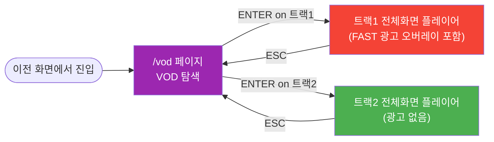
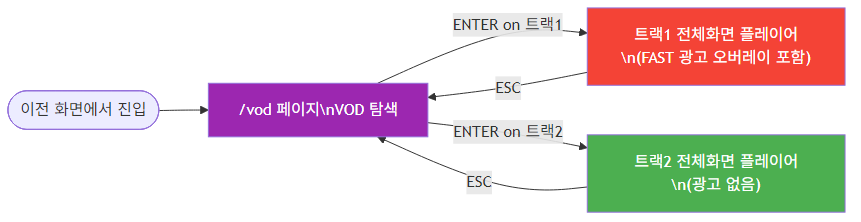

# D-04. UI/UX 화면 설계서 — VOD 서비스 (Storyboard)

> **문서 정보**

| 항목 | 내용 |
|------|------|
| 프로젝트명 | 2026_TV — VOD 서비스 |
| 문서 번호 | D-04 (VOD) |
| 문서 버전 | v1.0 |
| 작성일 | 2026-03-04 |
| **포함 화면** | **VOD 탐색 페이지 · 전체화면 VOD 플레이어 (트랙1/트랙2)** |
| **제외 화면** | **0번 커머스 채널 · 1~30번 실시간 채널 · 프로필 설정** |

---

## 1. VOD 화면 이동 흐름



<!-- mermaid-img-D04_UI_UX_VOD-1 -->



---

## 2. 화면 목록

| ID | 화면명 | 구성 요소 |
|----|--------|---------|
| S-VOD-01 | VOD 탐색 페이지 | 광고 배너 + 트랙1 캐러셀 + 트랙2 캐러셀 |
| S-VOD-02 | 트랙1 전체화면 플레이어 | 비디오 플레이어 + AdOverlay |
| S-VOD-03 | 트랙2 전체화면 플레이어 | 비디오 플레이어 (광고 없음) |

---

## 3. S-VOD-01. VOD 탐색 페이지 (`/vod`)

### 3.1 레이아웃

```
┌─────────────────────────────────────────────────────────────────┐
│ ① 광고 배너 섹션                                                 │
│  ┌───────────────────────────────────────────────────────────┐  │
│  │                                                           │  │
│  │           [광고 배너 이미지 — 풀 너비]                     │  │
│  │                                                           │  │
│  │  ◀                         ● ○ ○ ○                  ▶   │  │  ← 인디케이터 + 화살표 버튼
│  └───────────────────────────────────────────────────────────┘  │
├─────────────────────────────────────────────────────────────────┤
│ ② 금주의 무료 VOD (트랙1)                  [ 3 / 10 ] ← 현재위치│
│  ┌──────┐ ┌──────┐ ┌──────┐ ┌──────┐ ┌──────┐ ┌──────┐        │
│  │ #1   │ │▌#2★ │ │ #3   │ │ #4   │ │ #5   │ │ #6   │  ─→    │  ← ★ = 포커스
│  │ 썸네일│ │ 썸네일│ │ 썸네일│ │ 썸네일│ │ 썸네일│ │ 썸네일│        │
│  │      │ │      │ │      │ │      │ │      │ │      │        │
│  │[KIDS]│ │[DOCU]│ │[KIDS]│ │[DOCU]│ │[ENT] │ │[ETC] │        │  ← 슬롯 배지
│  │ 제목 │ │ 제목  │ │ 제목 │ │ 제목  │ │ 제목 │ │ 제목  │        │
│  └──────┘ └──────┘ └──────┘ └──────┘ └──────┘ └──────┘        │
├─────────────────────────────────────────────────────────────────┤
│ ③ 당신을 위한 추천 VOD (트랙2)             [ 1 / 10 ]           │
│  ┌──────┐ ┌──────┐ ┌──────┐ ┌──────┐ ┌──────┐ ┌──────┐        │
│  │ 추천1 │ │ 추천2 │ │ 추천3 │ │ 추천4 │ │ 추천5 │ │ 추천6 │  ─→  │
│  │ 썸네일│ │ 썸네일│ │ 썸네일│ │ 썸네일│ │ 썸네일│ │ 썸네일│        │
│  │ 제목  │ │ 제목  │ │ 제목  │ │ 제목  │ │ 제목  │ │ 제목  │        │
│  └──────┘ └──────┘ └──────┘ └──────┘ └──────┘ └──────┘        │
└─────────────────────────────────────────────────────────────────┘
```

### 3.2 키 이벤트

| 키 | 현재 포커스 위치 | 동작 |
|----|----------------|------|
| `▲` | 트랙1 | 배너 섹션으로 이동 |
| `▼` | 배너 | 트랙1 섹션으로 이동 |
| `▼` | 트랙1 | 트랙2 섹션으로 이동 |
| `▲` | 트랙2 | 트랙1 섹션으로 이동 |
| `←` | 카드 항목 | 이전 항목으로 포커스 이동 |
| `→` | 카드 항목 | 다음 항목으로 포커스 이동 |
| `←` | 배너 | 이전 배너로 이동 |
| `→` | 배너 | 다음 배너로 이동 |
| `ENTER` | 트랙1 카드 | 트랙1 전체화면 플레이어 전환 |
| `ENTER` | 트랙2 카드 | 트랙2 전체화면 플레이어 전환 |
| `ENTER` | 배너 | 광고 상세 팝업 (선택 사항) |
| `ESC` | 전체 | 이전 화면 복귀 |

### 3.3 슬라이딩 윈도우 동작

```
전체 10개 항목 중 6개를 화면에 표시.
포커스가 현재 뷰 범위(6번)를 벗어나면 윈도우 자동 이동.

예시:
포커스 #1~#6 표시 → Enter→ 로 #6 선택 후 →키 → #2~#7 표시
포커스 #5~#10 표시 → Enter← 로 #5 선택 후 ←키 → #4~#9 표시

현재 위치 표시: "3 / 10" (현재 포커스 / 전체 수)
```

### 3.4 섹션별 데이터 로드

```
/vod 페이지 마운트 시:
1. GET /api/v1/vod/weekly    → 트랙1 VOD 10개 (rank_no 순)
2. POST /admin/recommend {user_id, top_n:10}  → 트랙2 VOD 10개
   ↑ 두 요청 병렬 실행 (Promise.all)
3. 배너 데이터 로드 (정적 또는 별도 API)
```

### 3.5 VOD 카드 표시 항목

| 항목 | 트랙1 | 트랙2 |
|------|-------|-------|
| 썸네일 이미지 | ✅ | ✅ |
| 제목 | ✅ | ✅ |
| 장르 | ✅ | ✅ |
| 순위 배지 (`#N`) | ✅ | ❌ |
| 슬롯 배지 (`KIDS`/`DOCU`/`ENT`/`ETC`) | ✅ (선택) | ❌ |
| 추천 사유 | ❌ | ✅ (선택) |
| 광고 아이콘 🎬 | ✅ | ❌ |

---

## 4. S-VOD-02. 트랙1 전체화면 플레이어 (FAST 광고 포함)

### 4.1 레이아웃

```
┌─────────────────────────────────────────────────────────────────┐
│                                                                  │
│                                                                  │
│                   [VOD 영상 풀스크린 재생]                         │
│                                                                  │
│                                                                  │
│                                                                  │
│  ┌──────────────────────────────────────────────────────────┐   │
│  │ 🎬  [광고 이미지 또는 영상]              ← display_position │   │
│  │     지금 바로 만나보세요: LG OLED TV 65인치                 │   │  ← OVERLAY_BOTTOM
│  │     ₩1,990,000                                            │   │
│  └──────────────────────────────────────────────────────────┘   │
│  (4초 후 자동 사라짐)                                             │
│                                                                  │
│  [ESC] 종료                              재생시간: 00:02:05      │
└─────────────────────────────────────────────────────────────────┘
```

### 4.2 광고 오버레이(AdOverlay) 동작 명세

| 항목 | 값 |
|------|-----|
| 위치 | `OVERLAY_BOTTOM` (화면 하단 고정) |
| 표시 시간 | `display_duration_sec` (기본 4초) |
| 체크 주기 | 1초마다 `currentTime` 확인 |
| 중복 방지 | 동일 `timestamp_sec` 는 재생 회차 내 **1회만** 노출 |
| 표시 조건 | `IS_ACTIVE='Y'` AND `confidence >= 0.5` (기본 필터) |

**AdOverlay 상태 전환**:
```
영상 재생 중
  → 매 1초: currentTime ≈ timestamp_sec AND 미노출?
  → YES: AdOverlay 렌더링 (4초)
  → 4초 후: 자동 숨김 + 해당 timestamp 노출 완료 마킹(Set)
  → NO: 계속 재생
```

### 4.3 광고 유형별 렌더링

| AD_TYPE | 렌더링 방식 | 크기 |
|---------|-----------|------|
| `IMAGE` | `` 태그, 애니메이션 fade-in | 화면 너비 × 자동 높이 |
| `VIDEO_SILENT` | `<video autoplay muted>` 태그 | 화면 너비 × 자동 높이 |

---

## 5. S-VOD-03. 트랙2 전체화면 플레이어 (광고 없음)

### 5.1 레이아웃

```
┌─────────────────────────────────────────────────────────────────┐
│                                                                  │
│                                                                  │
│                   [VOD 영상 풀스크린 재생]                         │
│                   (광고 오버레이 없음)                             │
│                                                                  │
│                                                                  │
│                                                                  │
│                                                                  │
│  [ESC] 종료                              재생시간: 00:03:12      │
└─────────────────────────────────────────────────────────────────┘
```

**트랙1과의 차이점**:
- `AdOverlay` 컴포넌트 미활성화 (`null` 렌더링)
- 광고 삽입 포인트 API 호출 없음
- 세션 시작 시 `session_type: "VOD_TRACK2"`

---

## 6. 컴포넌트 구조 (VOD 범위)

```
frontend/app/vod/
└── page.tsx                      # VOD 페이지 메인

frontend/components/
├── VodBanner/
│   └── index.tsx                 # 광고 배너 캐러셀 (5초 자동 전환)
├── VodCarousel/
│   ├── index.tsx                 # 트랙1/트랙2 공통 캐러셀 컨테이너
│   ├── VodCard.tsx               # VOD 카드 (썸네일 + 제목 + 배지)
│   └── SlideWindow.tsx           # 슬라이딩 윈도우 뷰 관리
├── VideoPlayer/
│   └── index.tsx                 # 전체화면 비디오 플레이어
└── AdOverlay/
    └── index.tsx                 # FAST 광고 오버레이 (트랙1 전용)

frontend/hooks/
└── useVodKeyboard.ts             # VOD 페이지 키보드 이벤트 핸들러
```

---

## 7. 초기 로드 상태 처리

| 상황 | 처리 방법 |
|------|---------|
| 트랙1 로드 중 | 스켈레톤 카드 6개 표시 |
| 트랙2 로드 중 | 스켈레톤 카드 6개 표시 |
| 트랙1 없음 (AD_PIPELINE_STATUS=FAILED 등) | "현재 무료 VOD를 준비 중입니다." 메시지 |
| 추천 결과 없음 (Cold Start) | 인기 콘텐츠 표시 (score=1.0, reason="인기 콘텐츠 추천") |
| 영상 파일 없음 | "재생할 수 없는 콘텐츠입니다." 에러 표시 |
