# D-05. 상세 설계서 — VOD 서비스 (Detailed Design)

> **문서 정보**

| 항목 | 내용 |
|------|------|
| 프로젝트명 | 2026_TV — VOD 서비스 |
| 문서 번호 | D-05 (VOD) |
| 문서 버전 | v1.0 |
| 작성일 | 2026-03-04 |
| **포함 범위** | **슬롯 큐레이션 · NLP 추천 · FAST 광고 파이프라인 · AdOverlay** |

---

## 1. 클래스 다이어그램

### 1.1 backend-api — VOD 관련 ORM 모델

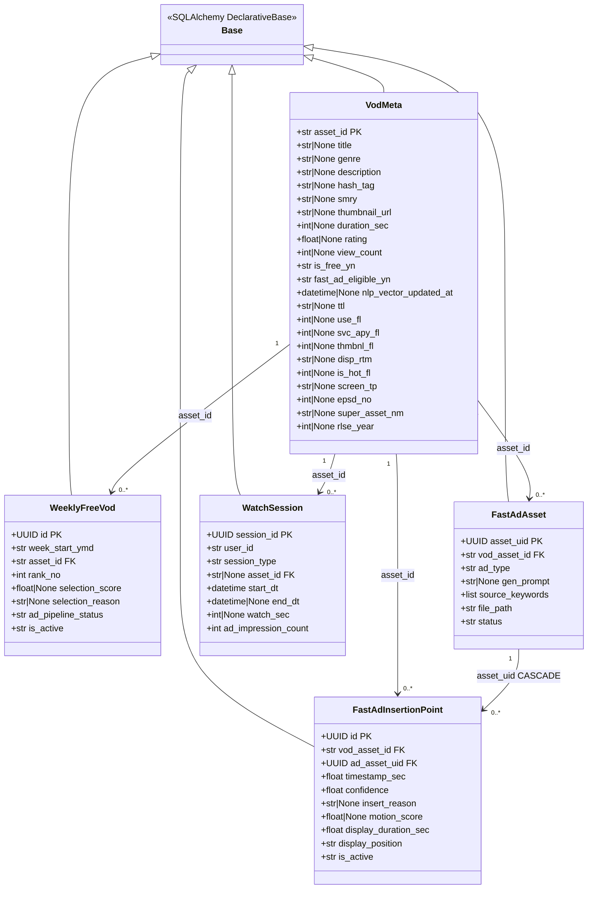

<!-- mermaid-img-D05_Detailed_Design_VOD-1 -->
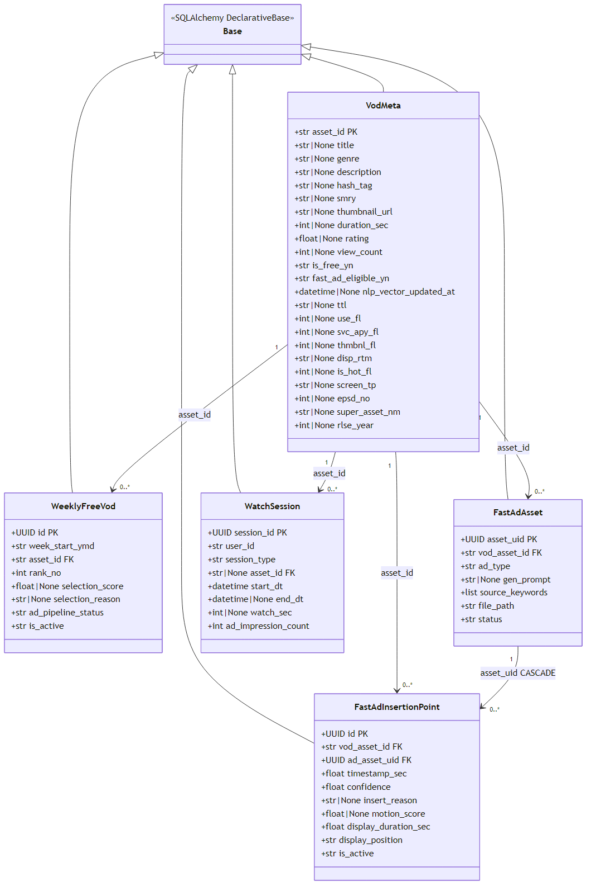


---

### 1.2 ad-batch — 모듈 의존 관계

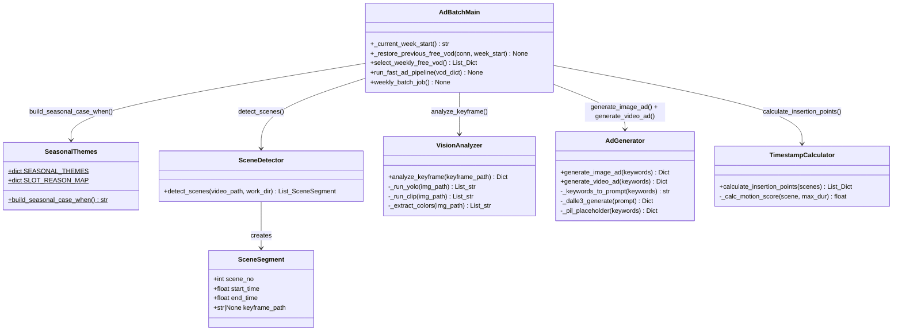

<!-- mermaid-img-D05_Detailed_Design_VOD-2 -->
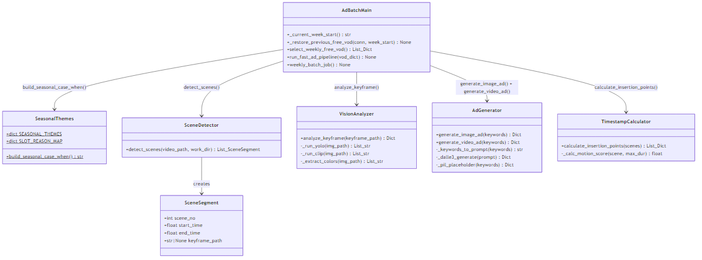


---

## 2. 시퀀스 다이어그램

### 2.1 트랙1 VOD 배치 선정 시퀀스 (v2 CTE 쿼리)

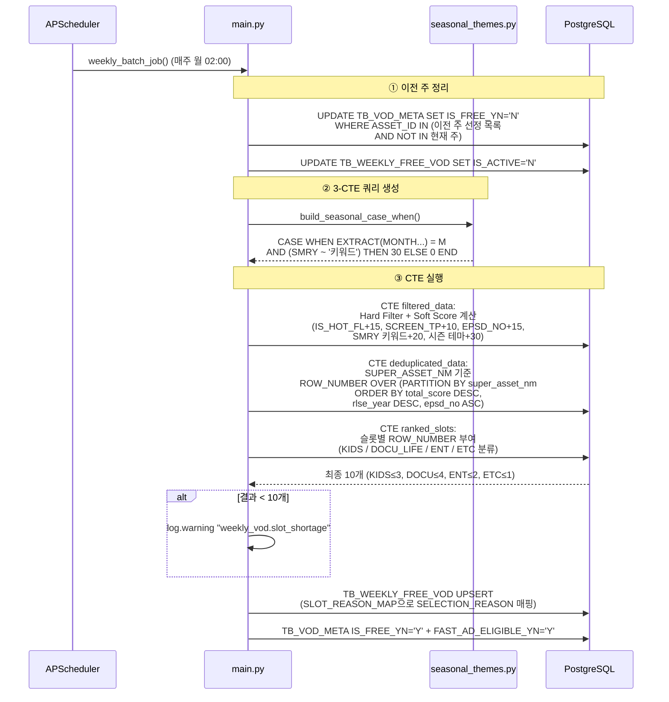

<!-- mermaid-img-D05_Detailed_Design_VOD-3 -->


---

### 2.2 FAST 광고 파이프라인 시퀀스 (단일 VOD)

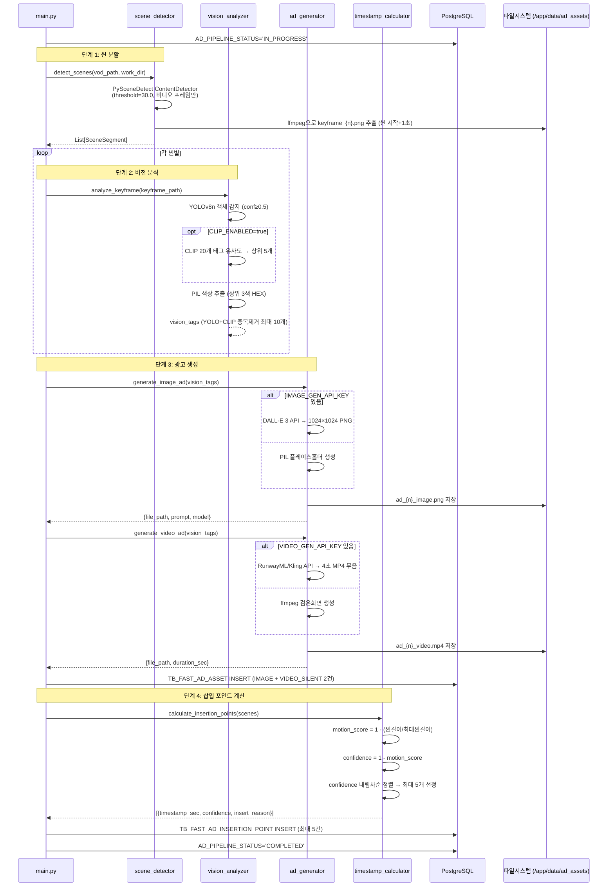

<!-- mermaid-img-D05_Detailed_Design_VOD-4 -->
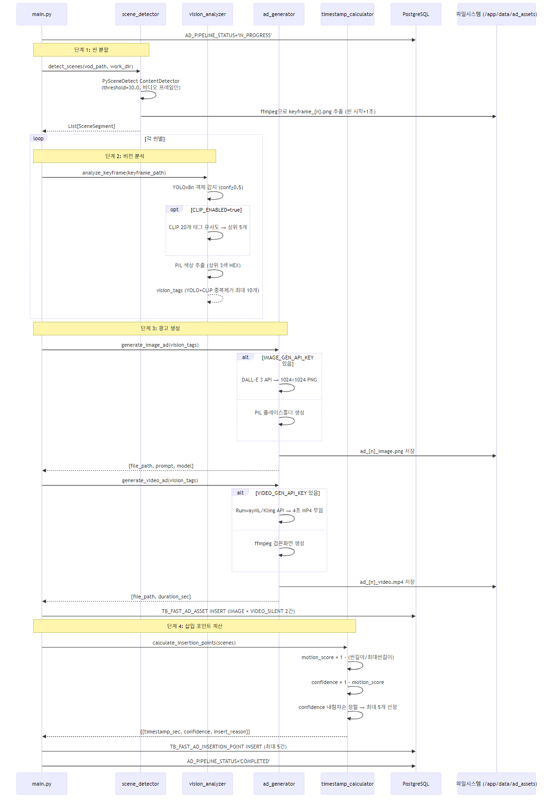


---

### 2.3 NLP 개인화 추천 시퀀스

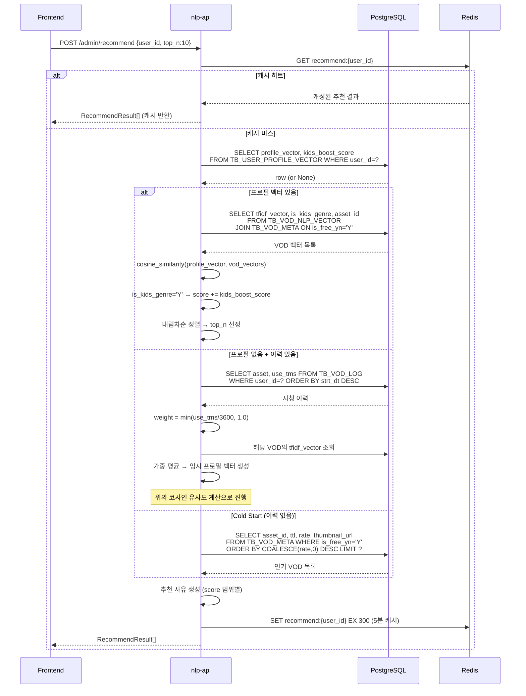

<!-- mermaid-img-D05_Detailed_Design_VOD-5 -->
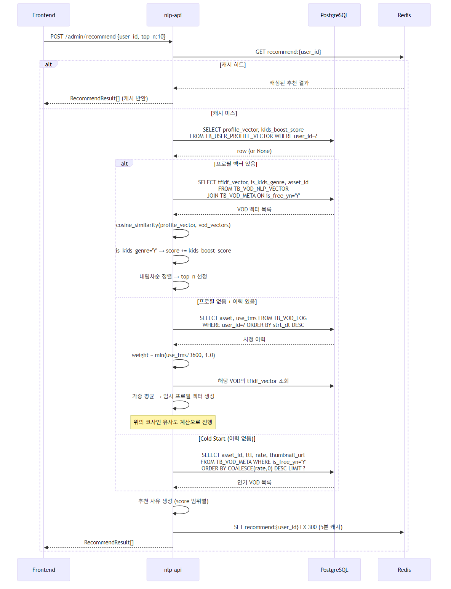


---

### 2.4 FAST 광고 오버레이 재생 시퀀스

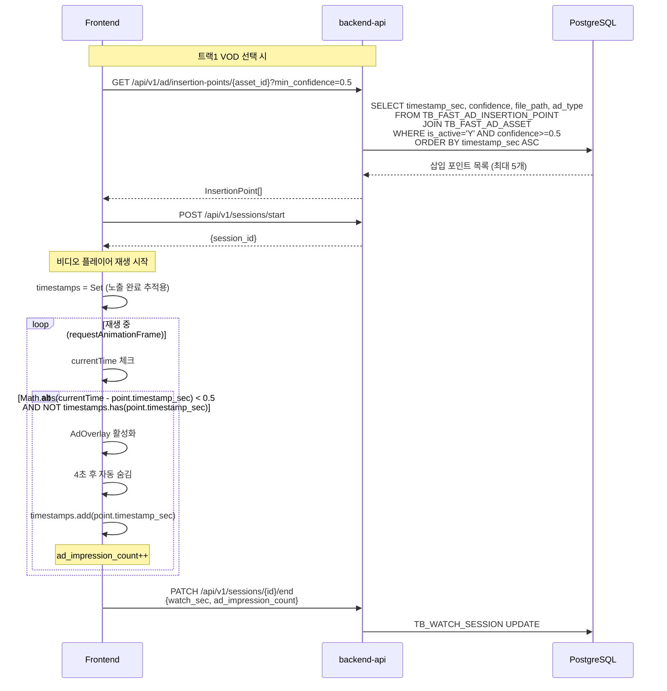

<!-- mermaid-img-D05_Detailed_Design_VOD-6 -->
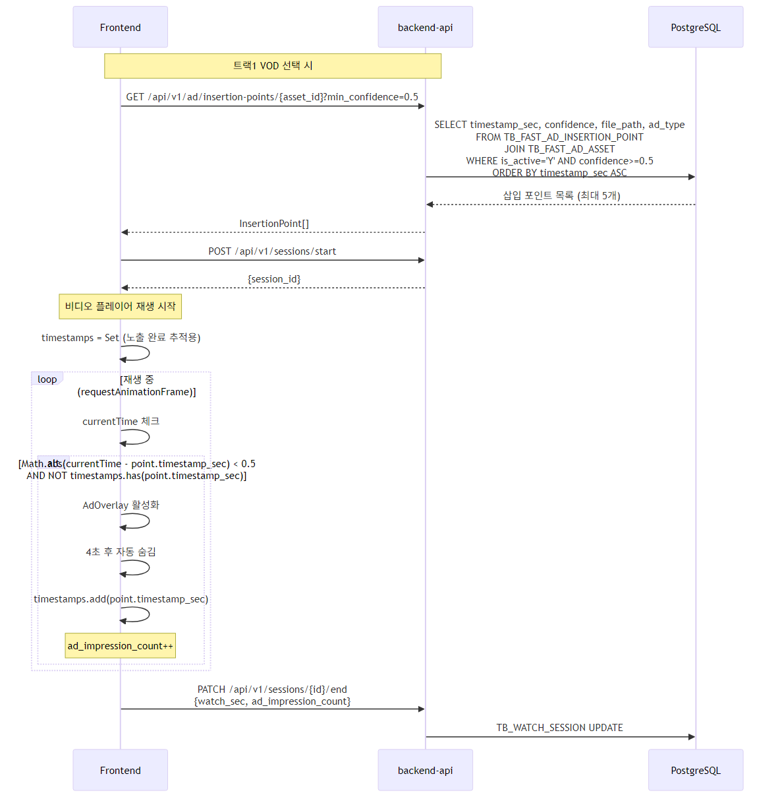


---

## 3. 핵심 알고리즘 상세

### 3.1 소프트 점수 계산 (v2 CTE: filtered_data)

```sql
/* 총점 = 인기작 + 화질 + 키즈1화 + 4060키워드 + 시즌테마 (최대 90점) */
CASE WHEN IS_HOT_FL = 1 THEN 15 ELSE 0 END       -- 인기작 +15
+ CASE WHEN SCREEN_TP IN ('HD','FHD','UHD') THEN 10 ELSE 0 END   -- 고화질 +10
+ CASE WHEN (GENRE LIKE '%키즈%' OR GENRE LIKE '%애니%')
          AND EPSD_NO = 1 THEN 15 ELSE 0 END       -- 키즈 1화 유도 +15
+ CASE WHEN SMRY ~ '(건강|자연인|고향|밥상|다큐|트로트)' THEN 20 ELSE 0 END  -- 4060 +20
+ [seasonal_themes.build_seasonal_case_when()]     -- 시즌 테마 +30

AS total_score
```

**점수 분포 예시**:

| 장르 | IS_HOT | SCREEN_TP | EPSD_NO | 4060 | 시즌 | 합계 |
|------|--------|----------|---------|------|------|------|
| 키즈 1화 (봄) | ✅ | FHD | 1 | - | 봄 매칭 | 70점 |
| 다큐 인기 | ✅ | UHD | - | ✅ | - | 45점 |
| 예능 일반 | - | HD | - | - | - | 10점 |

---

### 3.2 시리즈 중복 제거 (v2 CTE: deduplicated_data)

```sql
ROW_NUMBER() OVER (
    PARTITION BY COALESCE(SUPER_ASSET_NM, TTL)   -- 시리즈명이 없으면 제목으로 그룹화
    ORDER BY
        total_score DESC,    -- ① 최고점 VOD 우선
        RLSE_YEAR DESC,      -- ② 동점 시 최신 연도
        EPSD_NO ASC          -- ③ 같은 연도이면 1화 우선
) AS dedup_rank
-- WHERE dedup_rank = 1  (각 시리즈당 1편만 선택)
```

---

### 3.3 슬롯 배분 (v2 CTE: ranked_slots)

```sql
CASE
    WHEN GENRE LIKE '%키즈%' OR GENRE LIKE '%애니%'
         OR GENRE LIKE '%만화%' THEN 'KIDS'
    WHEN GENRE LIKE '%다큐%' OR GENRE LIKE '%교양%'
         OR GENRE LIKE '%자연%' THEN 'DOCU_LIFE'
    WHEN GENRE LIKE '%예능%' OR GENRE LIKE '%연예%'
         OR GENRE LIKE '%음악%' THEN 'ENTERTAINMENT'
    ELSE 'ETC'
END AS slot_group,

ROW_NUMBER() OVER (
    PARTITION BY slot_group
    ORDER BY total_score DESC
) AS slot_rank

-- 최종 필터:
-- slot_group='KIDS' AND slot_rank <= 3
-- slot_group='DOCU_LIFE' AND slot_rank <= 4
-- slot_group='ENTERTAINMENT' AND slot_rank <= 2
-- slot_group='ETC' AND slot_rank <= 1
```

---

### 3.4 광고 삽입 포인트 계산 (motion_score)

```python
def calculate_insertion_points(scenes: List[SceneSegment], max_count: int = 5):
    if not scenes:
        return []

    max_duration = max(s.end_time - s.start_time for s in scenes)

    candidates = []
    for scene in scenes:
        duration = scene.end_time - scene.start_time
        motion_score = 1.0 - (duration / max_duration)   # 짧을수록 고움직임
        confidence = 1.0 - motion_score                   # 긴 씬 = 저움직임 = 적합

        if confidence >= 0.5:                             # 최소 신뢰도 0.5
            if confidence >= 0.8:
                reason = "LOW_MOTION"
            elif confidence >= 0.6:
                reason = "SCENE_BREAK"
            else:
                reason = "QUIET_MOMENT"

            candidates.append({
                "timestamp_sec": scene.start_time + 1.0,  # 씬 시작 +1초
                "confidence": confidence,
                "insert_reason": reason,
                "motion_score": motion_score,
            })

    # confidence 내림차순 정렬 → 최대 5개 반환
    return sorted(candidates, key=lambda x: -x["confidence"])[:max_count]
```

---

### 3.5 유저 프로필 벡터 계산

```python
def build_user_profile(vod_log_rows, nlp_vectors):
    """
    vod_log_rows: [(asset_id, use_tms), ...]
    nlp_vectors:  {asset_id: tfidf_vector}
    """
    weighted_sum = None
    total_weight = 0.0
    kids_watch_sec = 0.0
    total_watch_sec = 0.0

    for asset_id, use_tms in vod_log_rows:
        weight = min(use_tms / 3600, 1.0)   # 최대 1시간 = 1.0
        vec = nlp_vectors.get(asset_id)
        if vec is None:
            continue

        if weighted_sum is None:
            weighted_sum = [v * weight for v in vec]
        else:
            for i, v in enumerate(vec):
                weighted_sum[i] += v * weight

        total_weight += weight
        total_watch_sec += use_tms
        if is_kids_genre(asset_id):        # TB_VOD_NLP_VECTOR.IS_KIDS_GENRE
            kids_watch_sec += use_tms

    if total_weight == 0:
        return None  # Cold Start fallback

    profile_vector = [v / total_weight for v in weighted_sum]

    kids_ratio = kids_watch_sec / max(total_watch_sec, 1)
    kids_boost = max(0.1, min(1.0, 0.3 + kids_ratio * 0.7))

    return {
        "profile_vector": profile_vector,
        "kids_boost_score": kids_boost,
        "total_watch_sec": total_watch_sec,
    }
```

---

## 4. 에러 처리 전략 (VOD 범위)

| 에러 유형 | 처리 방법 | 로그 레벨 |
|---------|---------|---------|
| VOD 파일 없음 | 더미 씬 1개 생성 → 파이프라인 계속 | WARNING |
| AI API 키 없음 | PIL 플레이스홀더 / ffmpeg 검은화면 | WARNING |
| CLIP 로드 실패 | YOLO만으로 계속(graceful fallback) | WARNING |
| 슬롯 10개 미달 | `weekly_vod.slot_shortage` 경고 + 선정된 수만 기록 | WARNING |
| 단일 VOD 파이프라인 실패 | `FAILED` 기록 + 다음 VOD 계속 | ERROR |
| tfidf.pkl 없음 | `tfidf_ready=false` 경고, Cold Start로 fallback | WARNING |
| DB 연결 실패 | pool_pre_ping=True 자동 재연결 | ERROR |
| 추천 API 실패 | 프론트엔드 오류 표시 → 사용자 재시도 안내 | ERROR |

---

## 5. 환경별 동작 행렬

| 항목 | 개발 (CPU) | 스테이징 (GPU) | 운영 (GPU) |
|------|-----------|-------------|-----------|
| CLIP | `false` | `true` | `true` |
| 이미지 광고 | PIL 플레이스홀더 | 테스트 API | DALL-E 3 실제 |
| 영상 광고 | ffmpeg 검은화면 | 테스트 API | RunwayML 실제 |
| VOD 파일 | 더미 씬 | 일부 존재 | 전체 존재 |
| TF-IDF 모델 | 수동 실행 필요 | 미리 실행 | 미리 실행 |
