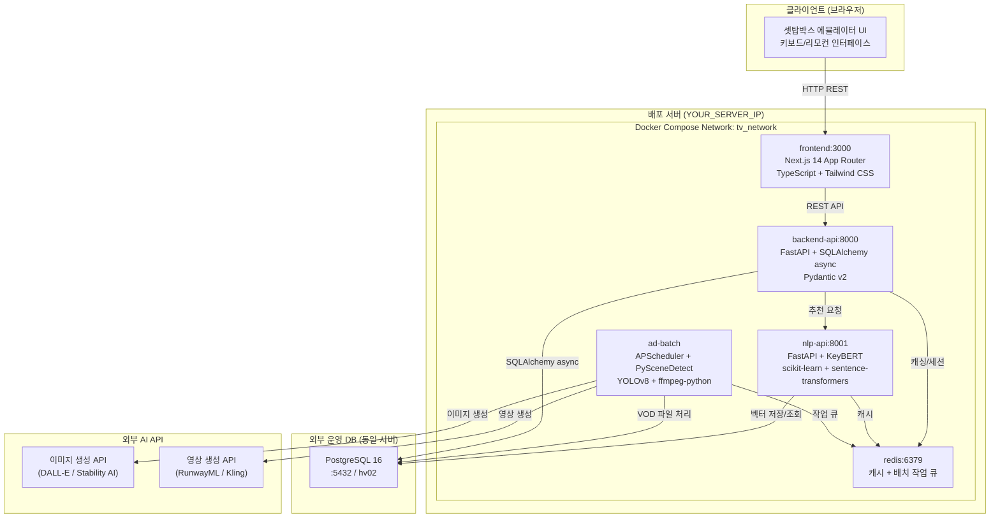
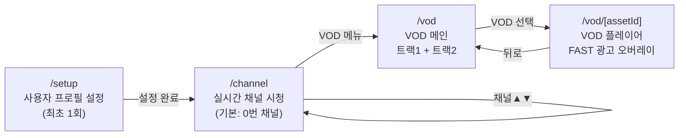
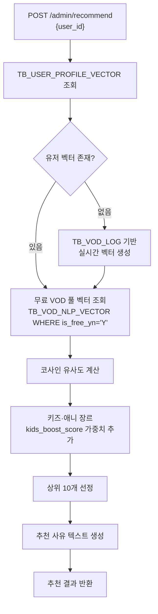
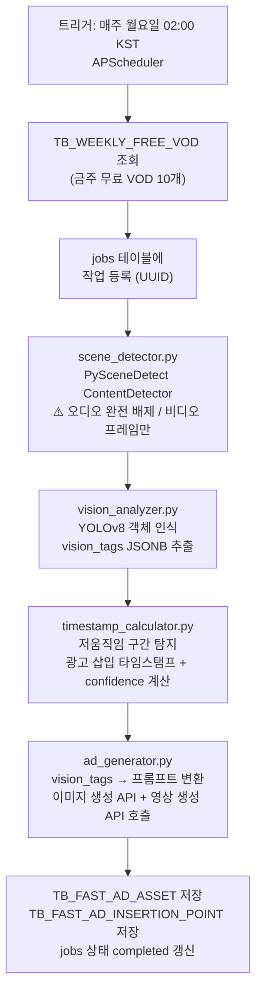
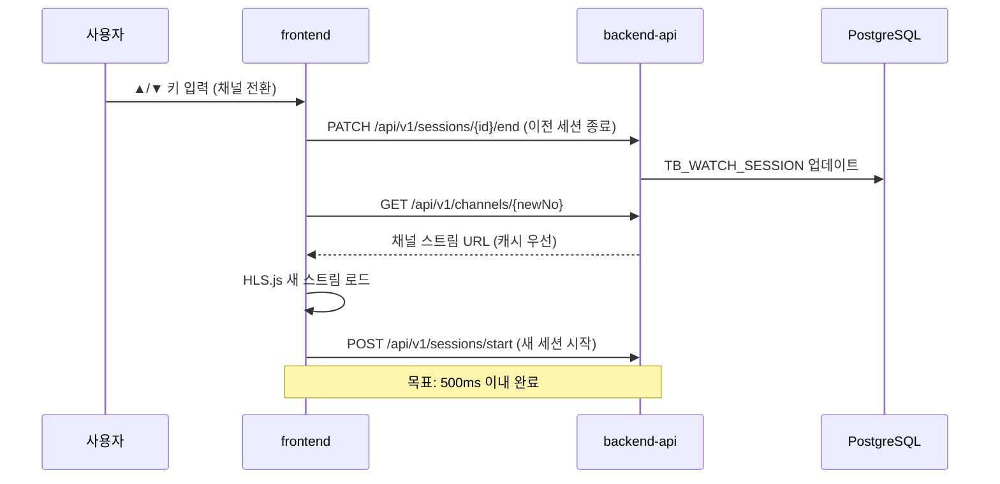
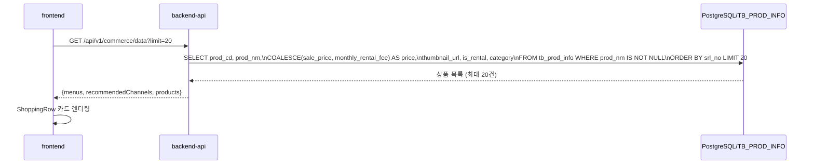
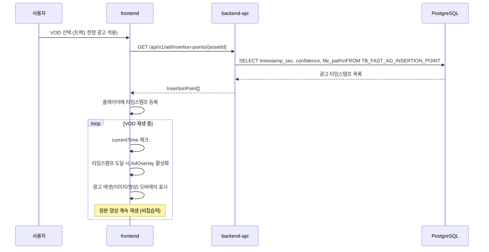
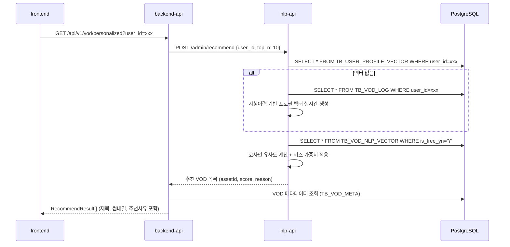
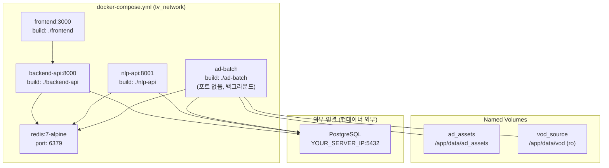

# 시스템 아키텍처 설계서

> **문서 정보**

| 항목 | 내용 |
|------|------|
| 프로젝트명 | 2026_TV — 차세대 미디어 플랫폼 |
| 문서 버전 | v1.0 |
| 작성일 | 2026-03-03 |
| 작성자 | 개발팀 |
| 상태 | 확정 |

---

## 1. 전체 시스템 구성도



---

## 2. 기술 스택

### 2.1 서비스별 기술 스택

| 서비스 | 언어/런타임 | 주요 프레임워크 | 포트 |
|--------|------------|--------------|------|
| **frontend** | TypeScript / Node.js | Next.js 14 (App Router), Tailwind CSS, hls.js | 3000 |
| **backend-api** | Python 3.11 | FastAPI, SQLAlchemy (async), Pydantic v2 | 8000 |
| **nlp-api** | Python 3.11 | FastAPI, scikit-learn, KeyBERT, sentence-transformers | 8001 |
| **ad-batch** | Python 3.11 | APScheduler, PySceneDetect, YOLOv8, ffmpeg-python | - (백그라운드) |
| **redis** | - | Redis 7 Alpine | 6379 |
| **DB** | PostgreSQL 16 | - | 5432 (외부) |

### 2.2 공통 인프라

| 항목 | 기술 |
|------|------|
| 컨테이너 오케스트레이션 | Docker + docker-compose v3.9 |
| 로깅 | structlog (backend-api), loguru (ad-batch) |
| 설정 관리 | pydantic-settings + `.env` 파일 |
| DB 연결 | asyncpg (비동기), psycopg2 (배치 동기) |

---

## 3. 서비스별 상세 설계

### 3.1 frontend (Next.js)

**역할**: 셋탑박스 UI 에뮬레이터 — 채널 시청, VOD 탐색, 커머스

**화면 구성**:



**핵심 컴포넌트**:

| 컴포넌트 | 역할 | 위치 |
|---------|------|------|
| `ChannelPlayer` | HLS.js 스트리밍 + Zapping 키 이벤트 | `/components/ChannelPlayer` |
| `CommerceChannel` | 0번 채널 커머스 UI (사이드바 + 상품 목록) | `/components/CommerceChannel` |
| `ShoppingRow` | 상품 카드 수평 스크롤 목록 | `/components/CommerceChannel/ShoppingRow` |
| `Sidebar` | 채널 메뉴 네비게이션 | `/components/CommerceChannel/Sidebar` |
| `VideoPlayer` | 추천 채널 영상 플레이어 | `/components/CommerceChannel/VideoPlayer` |
| `PurchaseModal` | 상품 구매 모달 (가격 < 20만원) | `/components/CommerceChannel/PurchaseModal` |
| `ConsultModal` | 상담 연결 모달 (가격 ≥ 20만원) | `/components/CommerceChannel/ConsultModal` |
| `ShoppingOverlay` | 비전 AI 쇼핑 매칭 결과 오버레이 | `/components/ShoppingOverlay` |
| `AdOverlay` | FAST 광고 오버레이 (타임스탬프 기반) | `/components/AdOverlay` |

**키 이벤트 매핑**:

| 키 | 동작 | 적용 채널 |
|----|------|---------|
| `▲` (ArrowUp) | 채널 올리기 | 전체 |
| `▼` (ArrowDown) | 채널 내리기 | 전체 |
| `L` | 채널 편성표 토글 | 1~30번 |
| `ESC` | 편성표/모달 닫기 | 1~30번 |
| `B` | 사이드바 토글 | 0번 |
| `←/→` | 포커스 이동 | 0번 커머스 |
| `Enter` | 메뉴/상품 선택 | 0번 커머스 |

---

### 3.2 backend-api (FastAPI)

**역할**: 메인 비즈니스 로직 API — 채널, VOD, 쇼핑, 세션, 광고, 커머스

**API 라우터 구성**:

| 메서드 | 경로 | 기능 | 연결 테이블 |
|--------|------|------|-----------|
| GET | `/health` | 헬스체크 | - |
| GET | `/api/v1/channels` | 채널 목록 조회 | `TB_CHANNEL_CONFIG` |
| GET | `/api/v1/channels/{no}` | 채널 상세 조회 | `TB_CHANNEL_CONFIG` |
| GET | `/api/v1/commerce/data` | 0번 채널 커머스 데이터 | `TB_PROD_INFO` |
| GET | `/api/v1/vod/weekly` | 금주 무료 VOD (트랙1) | `TB_WEEKLY_FREE_VOD`, `TB_VOD_META` |
| GET | `/api/v1/vod/free` | 무료 VOD 목록 | `TB_VOD_META` |
| GET | `/api/v1/vod/{assetId}` | VOD 상세 정보 | `TB_VOD_META` |
| GET | `/api/v1/ad/insertion-points/{assetId}` | 광고 삽입 타임스탬프 | `TB_FAST_AD_INSERTION_POINT` |
| GET | `/api/v1/shopping/match` | 키워드 기반 상품 매칭 | `TB_PROD_INFO` |
| GET | `/api/v1/shopping/products` | 상품 목록 조회 | `TB_PROD_INFO` |
| POST | `/api/v1/sessions/start` | 시청 세션 시작 | `TB_WATCH_SESSION` |
| PATCH | `/api/v1/sessions/{id}/end` | 시청 세션 종료 | `TB_WATCH_SESSION` |
| GET | `/api/v1/customers/{id}` | 고객 프로필 조회 | `TB_CUST_INFO` |

**의존성**:
- PostgreSQL (SQLAlchemy async via asyncpg)
- Redis (채널 목록, 금주 VOD 캐싱)
- nlp-api (개인화 VOD 추천 위임)

---

### 3.3 nlp-api (FastAPI)

**역할**: NLP 기반 VOD 개인화 추천 엔진

**API 엔드포인트**:

| 메서드 | 경로 | 기능 |
|--------|------|------|
| POST | `/admin/recommend` | 특정 유저 개인화 VOD 추천 10개 반환 |
| POST | `/admin/update_user_profile` | 유저 프로필 벡터 재계산 |
| POST | `/admin/vectorize` | VOD 전체 텍스트 벡터 재계산 (배치) |

**NLP 추천 파이프라인**:



**벡터화 방법**:
- 텍스트 소스: `TB_VOD_META.DESCRIPTION + HASH_TAG + GENRE + GENRE_OF_CT_CL + SMRY`
- 모델: TF-IDF Vectorizer (초기 벡터화) + KeyBERT (키워드 추출 강화)
- 한국어 모델: `snunlp/KR-ELECTRA-discriminator`

---

### 3.4 ad-batch (Python Batch Worker)

**역할**: FAST 광고 생성 파이프라인 (주 1회 APScheduler 배치)

**배치 실행 흐름**:



**중요 설계 원칙**:
- 원본 VOD 파일 **수정 없음** — 클라이언트 AdOverlay로 비침습적 광고 노출
- 씬 분할 시 **오디오 분석 철저 배제** — 비디오 ContentDetector만 사용
- 생성된 광고 에셋: 컨테이너 볼륨 `/app/data/ad_assets`에 저장

---

## 4. 데이터 흐름 설계

### 4.1 채널 Zapping 흐름



### 4.2 커머스 채널 상품 조회 흐름



### 4.3 VOD 재생 + FAST 광고 오버레이 흐름



### 4.4 NLP 개인화 추천 흐름



---

## 5. 배포 아키텍처

### 5.1 Docker Compose 구성



### 5.2 환경변수 관리

| 변수명 | 사용 서비스 | 설명 |
|--------|-----------|------|
| `DATABASE_URL` | backend-api, nlp-api, ad-batch | PostgreSQL asyncpg 연결 URL |
| `DATABASE_SYNC_URL` | ad-batch | psycopg2 동기 연결 URL |
| `REDIS_URL` | backend-api, nlp-api, ad-batch | Redis 연결 URL |
| `NEXT_PUBLIC_API_URL` | frontend (빌드시) | backend-api 주소 |
| `NEXT_PUBLIC_NLP_API_URL` | frontend (빌드시) | nlp-api 주소 |
| `CORS_ORIGINS` | backend-api | 허용 CORS 오리진 |
| `IMAGE_GEN_API_KEY` | ad-batch | 이미지 생성 AI API 키 |
| `IMAGE_GEN_API_URL` | ad-batch | 이미지 생성 AI 엔드포인트 |
| `VIDEO_GEN_API_KEY` | ad-batch | 영상 생성 AI API 키 |
| `KIDS_BOOST_SCORE` | nlp-api | 키즈·애니 추천 가중치 (0.0~1.0, 기본 0.3) |
| `KIDS_GENRE_CODES` | nlp-api | 키즈 장르 코드 목록 (쉼표 구분) |

---

## 6. 디렉토리 구조

```
2026_TV/
├── claude.md                       # AI 에이전트 컨텍스트 문서
├── changelog.md                    # 작업 이력
├── docker-compose.yml              # 서비스 오케스트레이션
├── .env                            # 실제 환경변수 (Git 제외)
├── .env.example                    # 환경변수 템플릿
│
├── docs/
│   ├── 1_requirements_specification.md   # 요구사항 정의서
│   ├── 2_system_architecture.md          # 시스템 아키텍처 (이 문서)
│   ├── 3_erd_and_table_definition.md     # ERD + 테이블 정의서
│   ├── 4_api_specification.md            # API 명세서
│   ├── 5_data_pipeline_flow.md           # 데이터 파이프라인 흐름도
│   ├── 6_test_cases.csv                  # 통합 테스트 케이스
│   ├── architecture.md                   # (레거시) 초기 아키텍처 설계
│   ├── ddl.sql                           # 기존 테이블 DDL
│   └── schema_additions.sql              # 신규 테이블 DDL
│
├── frontend/                       # Next.js 14 Web App
│   ├── Dockerfile
│   ├── package.json
│   ├── app/
│   │   ├── channel/page.tsx        # 채널 시청 메인 (기본: 0번)
│   │   ├── vod/page.tsx            # VOD 목록 (트랙1 + 트랙2)
│   │   └── setup/page.tsx          # 사용자 초기 설정
│   ├── components/
│   │   ├── ChannelPlayer/          # HLS 플레이어 + Zapping
│   │   ├── CommerceChannel/        # 0번 채널 커머스 전체
│   │   │   ├── index.tsx           # 메인 컨트롤러
│   │   │   ├── Sidebar.tsx         # 메뉴 네비게이션
│   │   │   ├── VideoPlayer.tsx     # 추천 채널 영상
│   │   │   ├── ShoppingRow.tsx     # 상품 카드 목록
│   │   │   ├── PurchaseModal.tsx   # 구매 모달
│   │   │   └── ConsultModal.tsx    # 상담 모달
│   │   ├── ShoppingOverlay/        # 비전 AI 쇼핑 오버레이
│   │   └── AdOverlay/              # FAST 광고 오버레이
│   ├── hooks/
│   │   └── useRemoteFocus.ts       # 리모컨 키 포커스 관리
│   └── lib/
│       └── api.ts                  # API 클라이언트 + 타입 정의
│
├── backend-api/                    # FastAPI 메인 API
│   ├── Dockerfile
│   ├── requirements.txt
│   └── app/
│       ├── main.py                 # FastAPI 앱 진입점
│       ├── core/
│       │   ├── config.py           # pydantic-settings 설정
│       │   └── db.py               # SQLAlchemy async engine
│       └── api/v1/
│           ├── channels.py         # 채널 API
│           ├── commerce.py         # 0번 채널 커머스 API
│           ├── vod.py              # VOD API
│           ├── shopping.py         # 쇼핑 매칭 API
│           ├── ad.py               # 광고 삽입 포인트 API
│           ├── sessions.py         # 시청 세션 API
│           └── customers.py        # 고객 API
│
├── nlp-api/                        # NLP 추천 엔진
│   ├── Dockerfile
│   ├── requirements.txt
│   └── app/
│       ├── main.py
│       ├── recommender.py          # 코사인 유사도 추천
│       └── vectorizer.py           # TF-IDF + KeyBERT 벡터화
│
└── ad-batch/                       # FAST 광고 배치 파이프라인
    ├── Dockerfile
    ├── requirements.txt
    └── app/
        ├── main.py                 # APScheduler 진입점
        ├── scene_detector.py       # PySceneDetect 씬 분할
        ├── vision_analyzer.py      # YOLOv8 객체 인식
        ├── ad_generator.py         # 생성형 AI 광고 생성
        └── timestamp_calculator.py # 최적 삽입 타임스탬프 계산
```

---

## 7. 성능 설계

| 항목 | 목표 | 구현 방법 |
|------|------|---------|
| 채널 전환 | < 500ms | HLS 프리로드, Redis 채널 URL 캐시 |
| 커머스 상품 조회 | < 300ms | srl_no 기준 정렬, DB 인덱스 활용 |
| VOD 개인화 추천 | < 200ms | 유저 벡터 사전 계산 후 Redis 캐시 |
| 광고 오버레이 렌더링 | < 100ms | 에셋 사전 생성 + 로컬 볼륨 마운트 |
| 쇼핑 키워드 매칭 | < 1,000ms | ILIKE 다중 조건, YOLO nano 모델 |
| NLP 전체 벡터화 | 배치 처리 | 주 1회 오프피크 시간대 실행 |
| DB 연결 풀 | pool_size=10, overflow=20 | SQLAlchemy async engine 설정 |

---

## 8. 보안 설계

| 항목 | 설계 |
|------|------|
| 접속 정보 격리 | 모든 민감정보 `.env`에서만 관리, 코드 하드코딩 금지 |
| Git 보안 | `.env`는 `.gitignore` 필수 포함 |
| CORS | 운영환경에서 `CORS_ORIGINS=*` 사용 금지, 도메인 명시 |
| 서비스 간 통신 | Docker 내부 네트워크(`tv_network`) 사용, 불필요한 포트 노출 최소화 |
| AI API 키 | `IMAGE_GEN_API_KEY`, `VIDEO_GEN_API_KEY`는 ad-batch 서비스에서만 사용 |
| 고객 ID | `SHA2_HASH` 사용으로 원본 개인정보 비노출 |
